# Representação do Processo de Software (RAD)

Nosso grupo optou por utilizar o modelo **RAD (Rapid Application Development)**. Durante a pesquisa, encontramos diversas representações em que a fase de **Design do Usuário** é o principal ciclo iterativo. No entanto, escolhemos uma representação mais próxima da realidade do projeto. Por isso, na [Figura 6](#representação-visual-do-processo-de-software-rad) são apresentadas uma versão tradicional e outra adaptada, na qual os ciclos combinam **Design do Usuário** e **Construção Rápida**, seguindo o fluxo: **Prototipação → Iteração (DoR) → Implementação → Feedback do Cliente → Refinamento**.

## Representação visual do processo de software RAD

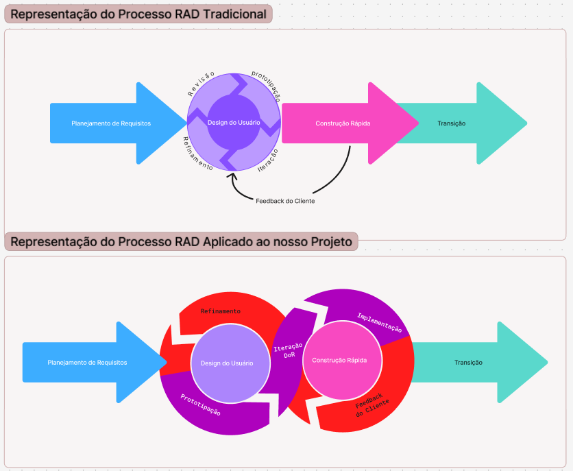
**Figura 6:** Representação do Processo RAD.
Fonte: Elaborada por [Pedro Lucas](https://github.com/pwdrinho)

## Representação visual das Atividades e Técnicas de ER

Paralelamente, as atividades e técnicas de Engenharia de Requisitos, detalhadas na [Sessão 5](../Visão%20do%20Produto%20e%20Projeto/engenhariaDeRequisitos.md), são realizadas durante todo o processo e podem ser visualizadas na [Figura 7](#representação-visual-das-atividades-e-técnicas-de-er).

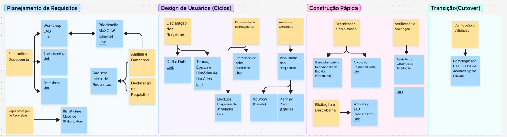
**Figura 7:** Atividades e Técnicas de ER.
Fonte: Elaborada por [Pedro Lucas](https://github.com/pwdrinho)

## Representações 

Para a atividade de **Representação**, foram utilizados **mockups**, **diagramas de atividades** e **protótipos de baixa fidelidade**. Os mockups, uma forma de **representação informal**, auxiliaram na visualização das interfaces, enquanto os diagramas de atividades, uma **representação semi-informal**, permitiram modelar os fluxos e processos do sistema. Já os protótipos de baixa fidelidade, alinhados à abordagem RAD adotada, foram utilizados para validar e refinar requisitos ao longo das iterações. A escolha desses artefatos contribuiu significativamente para a comunicação com os stakeholders, especialmente por se tratar de um público com baixo nível de letramento, tornando os requisitos e funcionalidades mais fáceis de compreender.

## Ciclos da Unidade 3

Para organizar o desenvolvimento do MVP, foram definidos pequenos ciclos de trabalho com escopo reduzido, estruturados a partir dos épicos e histórias de usuário priorizados. Cada ciclo seguiu o fluxo **Planejamento → Prototipação → Aplicação do DoR (Definition of Ready) → Implementação → Validação com o Cliente**. Essa abordagem permitiu obter feedback frequente dos stakeholders, validar os requisitos antes da implementação e realizar ajustes de forma contínua, reduzindo retrabalho e garantindo que as funcionalidades desenvolvidas estivessem alinhadas às necessidades dos usuários.

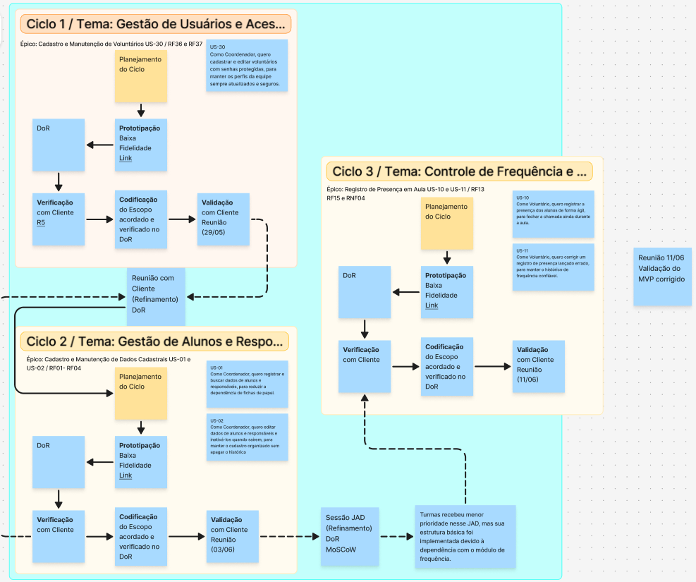
**Figura 8:** Ciclos da Unidade 3
Fonte: Elaborada por [Pedro Lucas](https://github.com/pwdrinho)

=== "Ciclo 1"
    ## Ciclo 1 
    O **Ciclo 1** foi dedicado ao tema **Gestão de Usuários e Acessos**, do épico **Cadastro e Manutenção de Voluntários**, abrangendo a História de Usuário **US-30**: *"Como Coordenador, quero cadastrar e editar voluntários com senhas protegidas, para manter os perfis da equipe sempre atualizados e seguros."*

    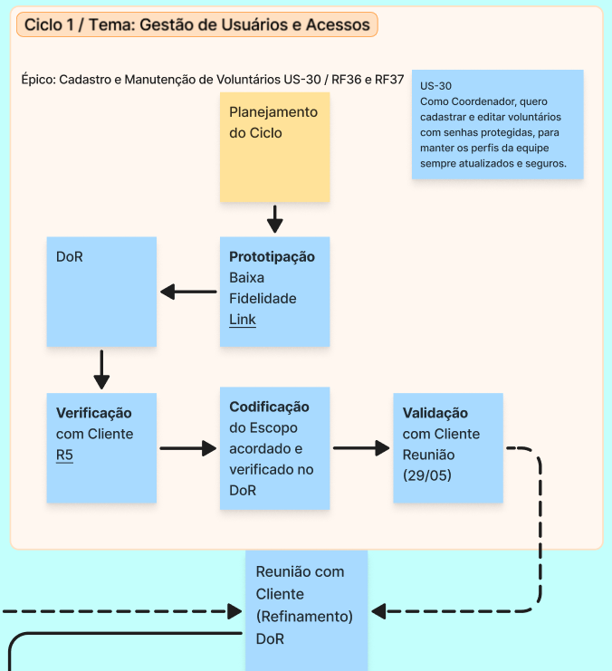
    **Figura 9:** Ciclo 1
    Fonte: Elaborada por [Pedro Lucas](https://github.com/pwdrinho)

    ### Planejamento do Ciclo
    Como parte do planejamento do ciclo, foram construídos os artefatos de representação definidos para o projeto, descritos na seção [representações](#representações). Os mockups e diagramas de atividades elaborados tiveram como objetivo facilitar a comunicação com os stakeholders e apoiar a verificação dos requisitos (DoR) antes do início da implementação, sendo apresentados a seguir.

    
    **Figura 10:** Diagrama de Atividades Cadastrar Voluntário e Editar Voluntário
    Fonte: Elaborada por [Pedro Lucas](https://github.com/pwdrinho)

    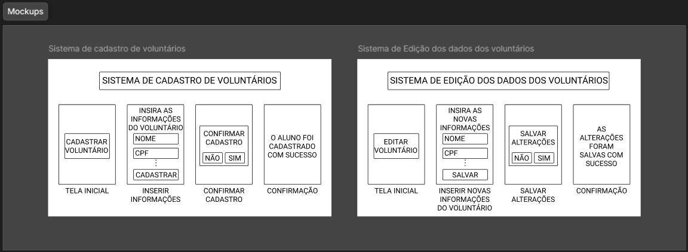
    **Figura 11:** Mockups Cadastrar Voluntário e Editar Voluntário
    Fonte: Elaborada por [Pedro Ramos](https://github.com/PedroRSR)

    ### Prototipação de Baixa Fidelidade
    Durante a etapa de prototipação, foram construídos os protótipos de baixa fidelidade que compõem o processo RAD adotado. Esses artefatos permitiram representar as funcionalidades de forma rápida e visual, facilitando a validação dos requisitos e a obtenção de feedback antes do início da implementação.

    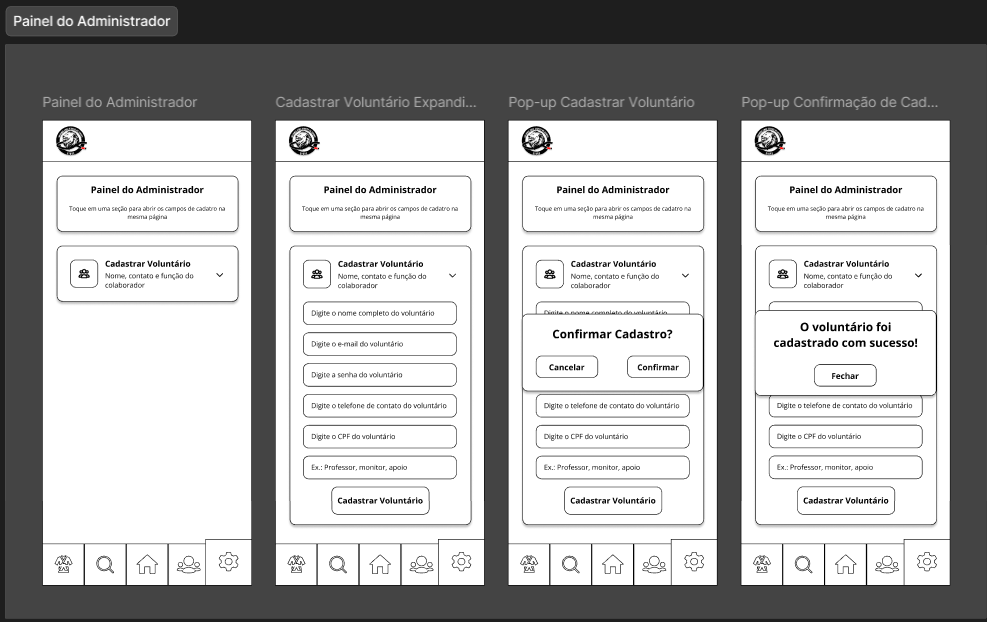
    **Figura 12:** Protótipos de Baixa Fidelidade Cadastrar Voluntário e Editar Voluntário
    Fonte: Elaborada por [Pedro Ramos](https://github.com/PedroRSR)

    ### Implementação
    Após a validação do DoR e a aprovação do cliente, deu-se início à etapa de implementação. Nessa fase, as funcionalidades definidas durante o planejamento foram desenvolvidas e integradas ao sistema, tomando como base os mockups, diagramas de atividades e protótipos construídos ao longo do ciclo.

    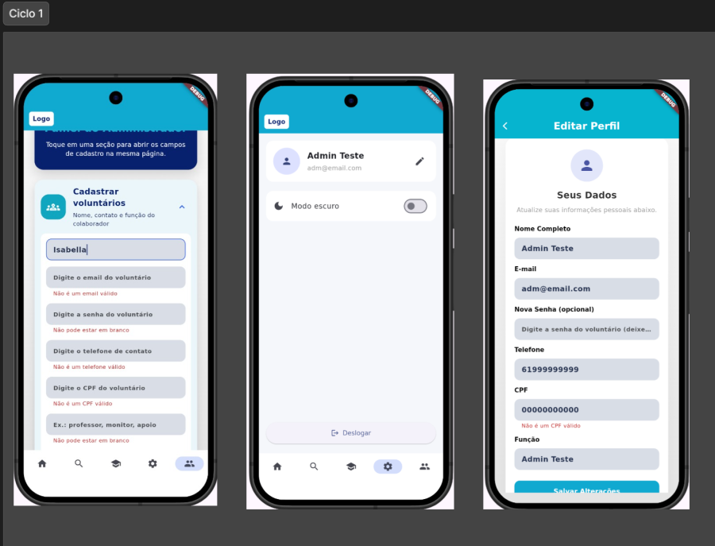
    **Figura 13:** Implementação Cadastrar Voluntário e Editar Voluntário
    Fonte: Elaborada por [Giovani de O.](https://github.com/Gotc2607)

    ### Validação com Cliente em reunião
    Em razão do curto prazo disponível, a reunião R5 desempenhou um papel duplo, além de realizar a validação das funcionalidades desenvolvidas no Ciclo 1, também foi utilizada para a verificação do DoR do Ciclo 2, otimizando o processo e mantendo o ritmo de desenvolvimento planejado.

=== "Ciclo 2"
    ## Ciclo 2
    O **Ciclo 2** foi dedicado ao tema **Gestão de Alunos e Responsáveis**, do épico **Cadastro e Manutenção de Dados Cadastrais**, abrangendo as Histórias de Usuários **US-01**: *"Como Coordenador, quero registrar e buscar dados de alunos e responsáveis, para reduzir a dependência de fichas de papel."* e **US02**: *"Como Coordenador, quero editar dados de alunos e responsáveis e inativá-los quando saírem, para manter o cadastro organizado sem apagar o histórico."* 

    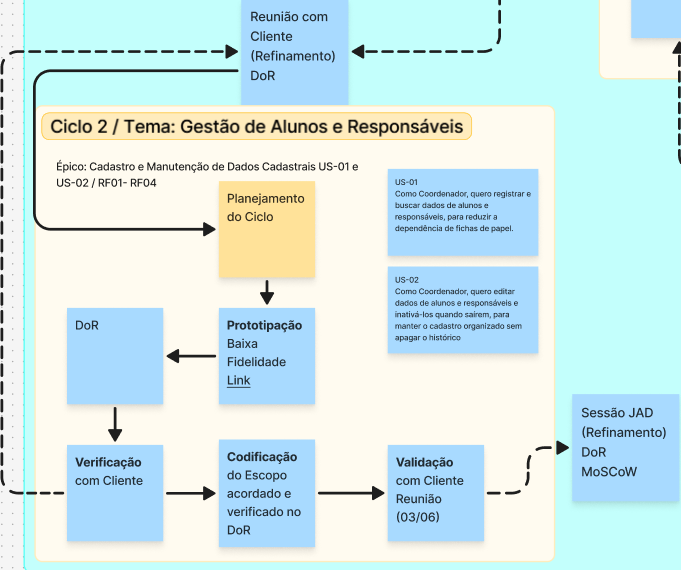
    **Figura 14:** Ciclo 2
    Fonte: Elaborada por [Pedro Lucas](https://github.com/pwdrinho)

    ### Planejamento do Ciclo 
    Como parte do planejamento do ciclo, foram construídos os artefatos de representação definidos para o projeto, descritos na seção [representações](#representações). Os mockups e diagramas de atividades elaborados tiveram como objetivo facilitar a comunicação com os stakeholders e apoiar a verificação dos requisitos (DoR) antes do início da implementação, sendo apresentados a seguir.

    
    **Figura 15:** Diagrama de Atividades Cadastrar Alunos, Editar dados Alunos, Inativar Alunos e Ativar Alunos
    Fonte: Elaborada por [Pedro Ramos](https://github.com/PedroRSR)

    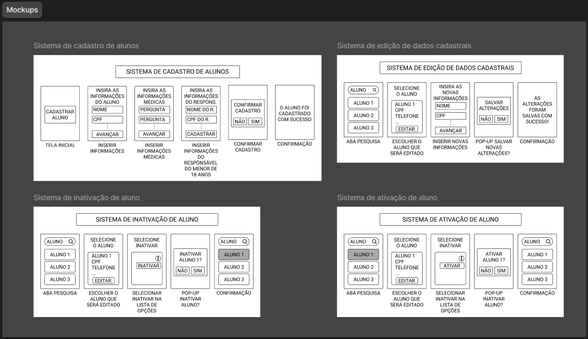
    **Figura 16:** Mockups Cadastrar Alunos, Editar dados Alunos, Inativar Alunos e Ativar Alunos
    Fonte: Elaborada por [Pedro Ramos](https://github.com/PedroRSR)

    ### Prototipação de Baixa Fidelidade
    Durante a etapa de prototipação, foram construídos os protótipos de baixa fidelidade que compõem o processo RAD adotado. Esses artefatos permitiram representar as funcionalidades de forma rápida e visual, facilitando a validação dos requisitos e a obtenção de feedback antes do início da implementação.

    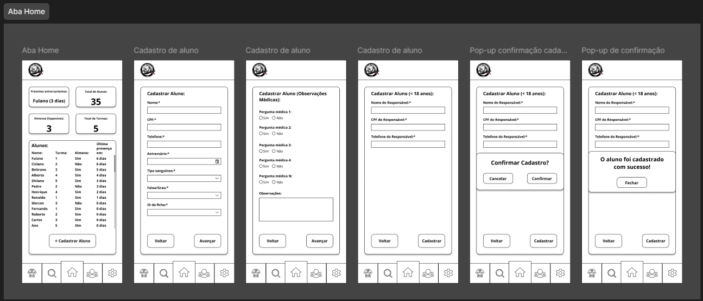
    **Figura 17:** Protótipos de Baixa Fidelidade Cadastrar Alunos
    Fonte: Elaborada por [Pedro Ramos](https://github.com/PedroRSR)

    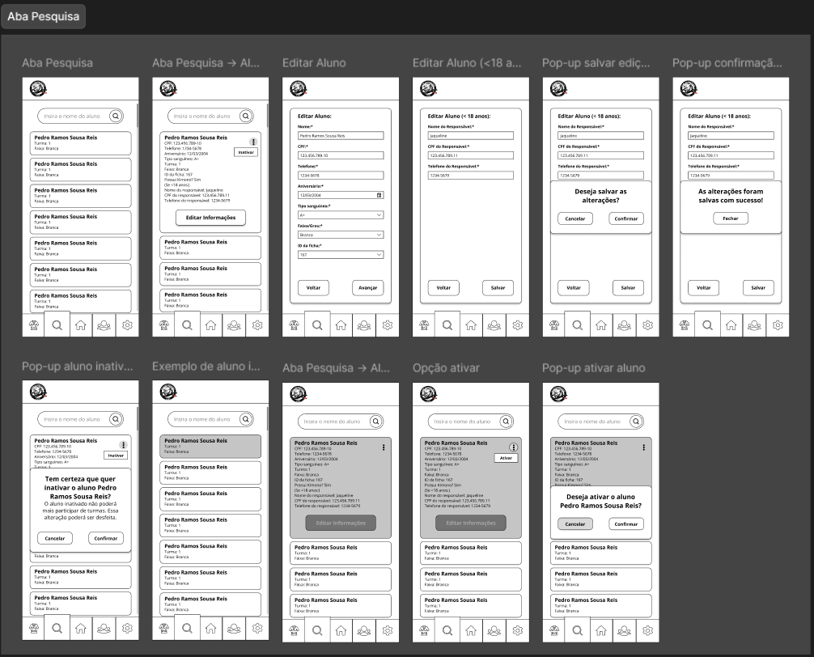
    **Figura 18:** Protótipos de Baixa Fidelidade Editar dados Alunos, Inativar Alunos e Ativar Alunos
    Fonte: Elaborada por [Pedro Ramos](https://github.com/PedroRSR)

    ### Implementação
    Após a validação do DoR e a aprovação do cliente, deu-se início à etapa de implementação. Nessa fase, as funcionalidades definidas durante o planejamento foram desenvolvidas e integradas ao sistema, tomando como base os mockups, diagramas de atividades e protótipos construídos ao longo do ciclo.

    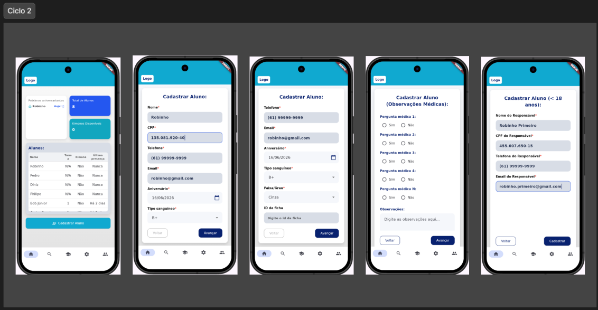
    **Figura 19:** Implementação Cadastrar Alunos
    Fonte: Elaborada por [Giovani de O.](https://github.com/Gotc2607)

    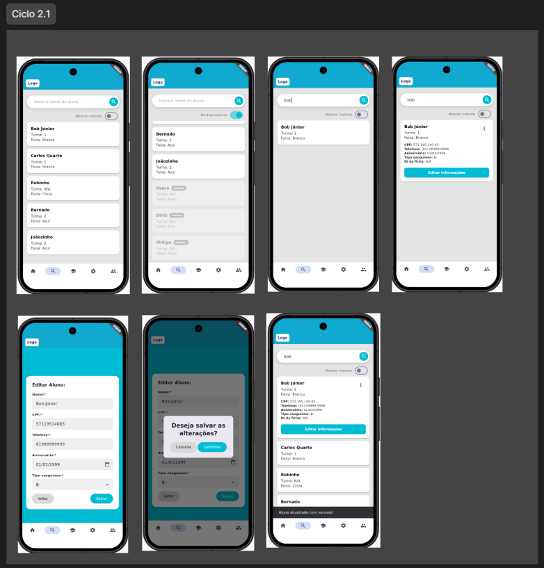
    **Figura 20:** Implementação Editar dados Alunos, Inativar Alunos e Ativar Alunos
    Fonte: Elaborada por [Pedro Lucas](https://github.com/pwdrinho)

    ### Validação com Cliente em reunião
    Assim como a **R5** desempenhou tanto o papel de validação do ciclo atual quanto de verificação para o ciclo seguinte, a **R6** não foi diferente. Durante a reunião, foi realizado um JAD que provocou poucas alterações na direção planejada para o **Ciclo 3**, embora já esperássemos que ele tivesse um escopo mais amplo. Entretanto, com a redução da prioridade de diversas funcionalidades previstas para esse ciclo, seu escopo foi diminuído, tornando-o mais compatível com os objetivos do projeto e com o tempo disponível para desenvolvimento.

=== "Ciclo 3"
    ## Ciclo 3
    O **Ciclo 3** foi dedicado ao tema **Controle de Frequência e Evasão**, do épico **Registro de Presença em Aula**, abrangendo as Histórias de Usuários **US-10**: *"Como Voluntário, quero registrar a presença dos alunos de forma ágil, para fechar a chamada ainda durante a aula."* e **US-11**: *"Como Voluntário, quero corrigir um registro de presença lançado errado, para manter o histórico de frequência confiável."*

    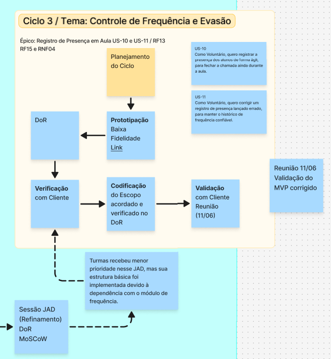
    **Figura 21:** Ciclo 3
    Fonte: Elaborada por [Pedro Lucas](https://github.com/pwdrinho)

    ### Planejamento do Ciclo 
    Como parte do planejamento do ciclo, foram construídos os artefatos de representação definidos para o projeto, descritos na seção [representações](#representações). Os mockups e diagramas de atividades elaborados tiveram como objetivo facilitar a comunicação com os stakeholders e apoiar a verificação dos requisitos (DoR) antes do início da implementação, sendo apresentados a seguir.

    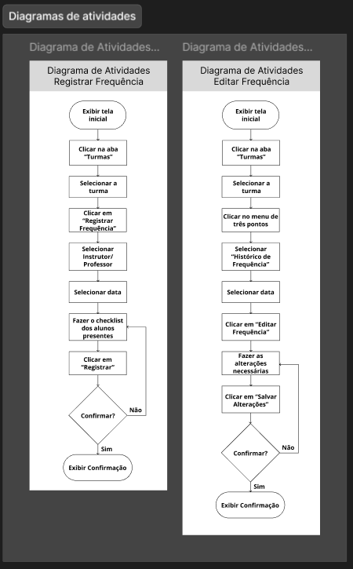
    **Figura 22:** Diagrama de Atividades Registrar frequência e Editar frequência
    Fonte: Elaborada por [Pedro Ramos](https://github.com/PedroRSR)

    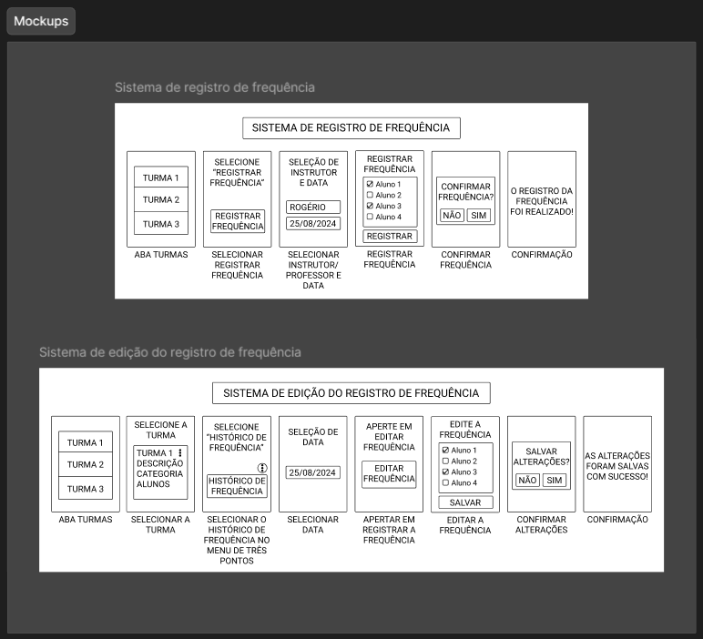
    **Figura 23:** Mockups Registrar frequência e Editar frequência
    Fonte: Elaborada por [Pedro Ramos](https://github.com/PedroRSR)

    ### Prototipação de Baixa Fidelidade
    Durante a etapa de prototipação, foram construídos os protótipos de baixa fidelidade que compõem o processo RAD adotado. Esses artefatos permitiram representar as funcionalidades de forma rápida e visual, facilitando a validação dos requisitos e a obtenção de feedback antes do início da implementação.

    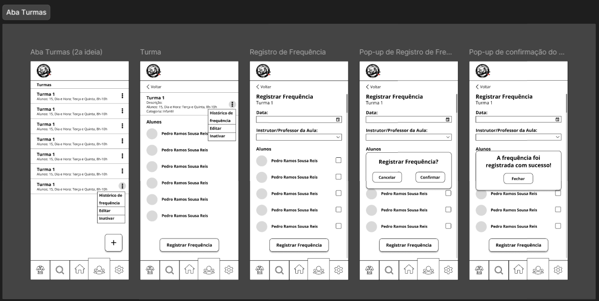
    **Figura 24:** Protótipos de Baixa Fidelidade Registrar frequência
    Fonte: Elaborada por [Pedro Ramos](https://github.com/PedroRSR)

    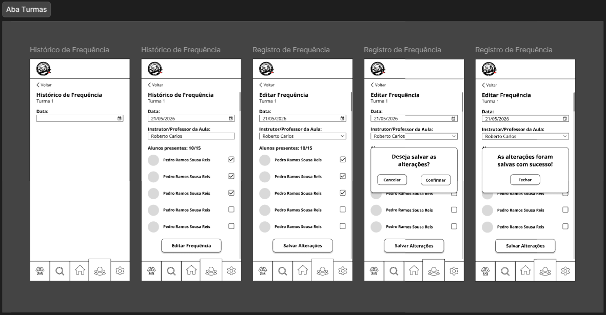
    **Figura 25:** Protótipos de Baixa Fidelidade Editar frequência
    Fonte: Elaborada por [Pedro Ramos](https://github.com/PedroRSR)

    ### Implementação
    Após a validação do DoR e a aprovação do cliente, deu-se início à etapa de implementação. Nessa fase, as funcionalidades definidas durante o planejamento foram desenvolvidas e integradas ao sistema, tomando como base os mockups, diagramas de atividades e protótipos construídos ao longo do ciclo.

    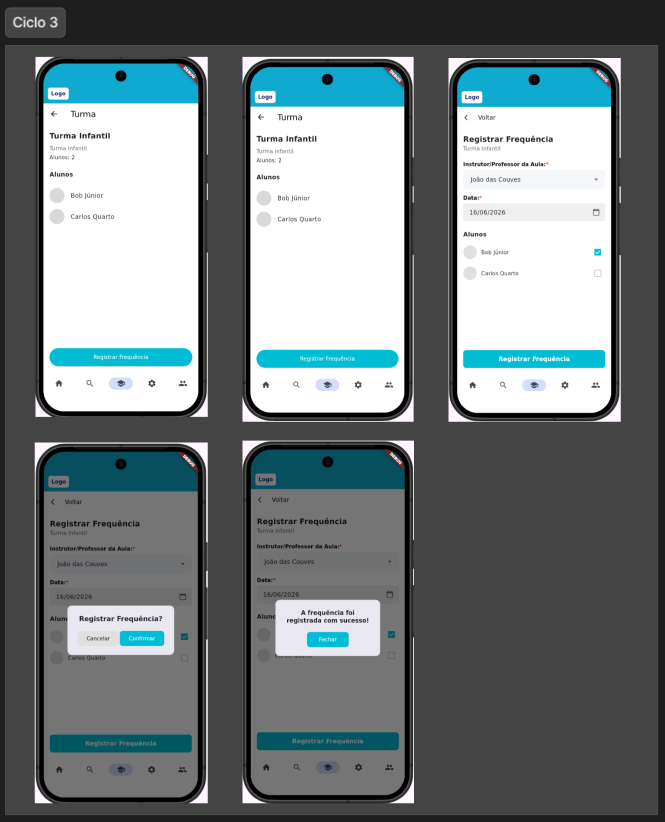
    **Figura 26:** Implementação Registrar frequência
    Fonte: Elaborada por [Giovani de O.](https://github.com/Gotc2607) e [Pedro Lucas](https://github.com/pwdrinho)

    ### Validação com Cliente em reunião
    Na R7, foi conduzida a validação do Ciclo 3, acompanhada de uma retrospectiva sobre todas as funcionalidades desenvolvidas até então. A reunião também contemplou a validação do MVP atualizado, permitindo avaliar a evolução da solução como um todo.