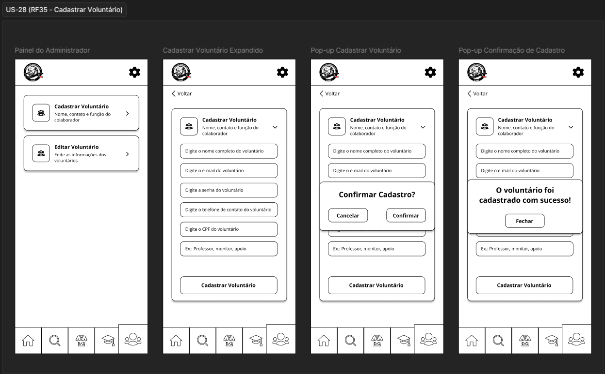
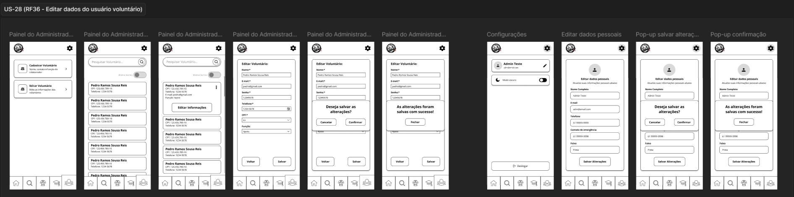
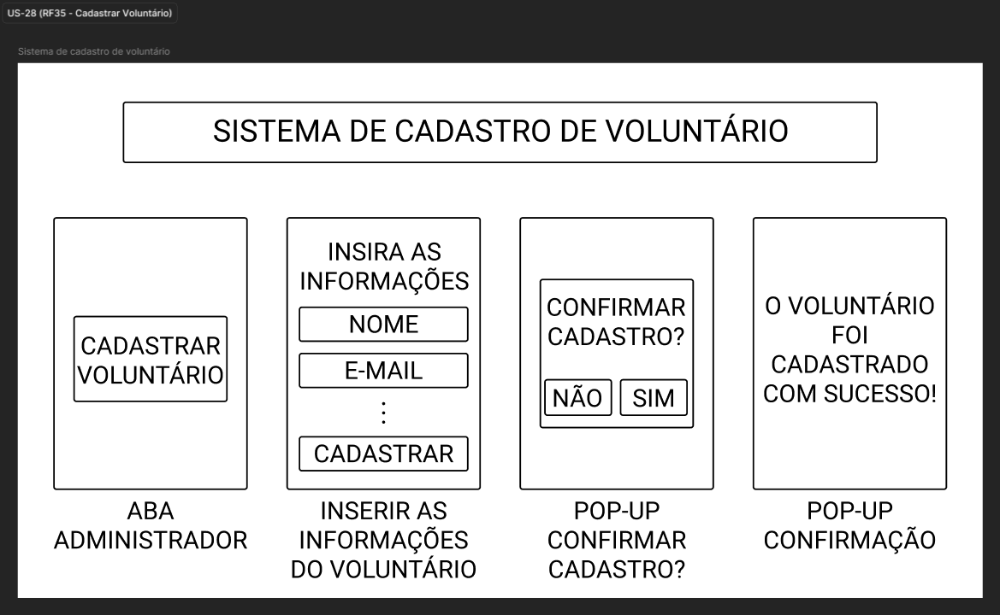
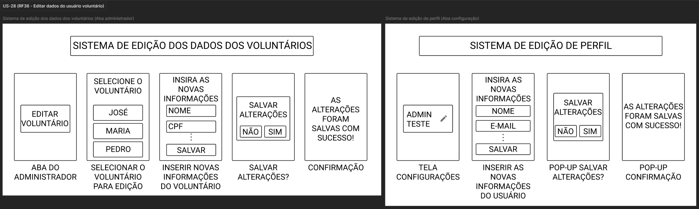
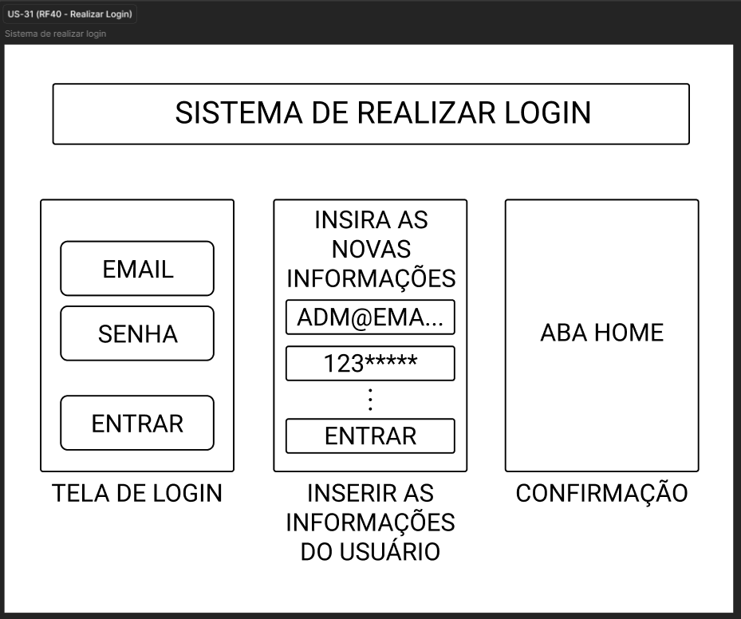
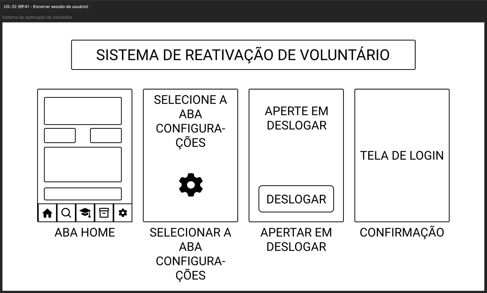
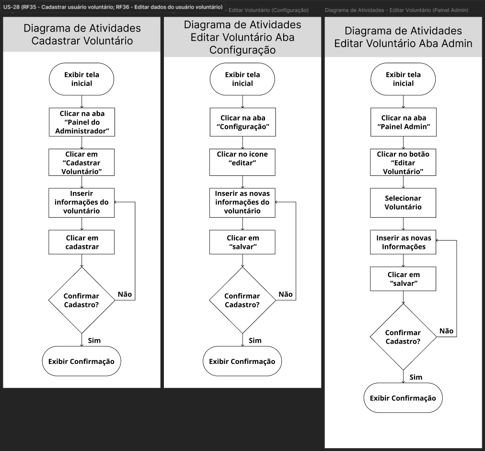
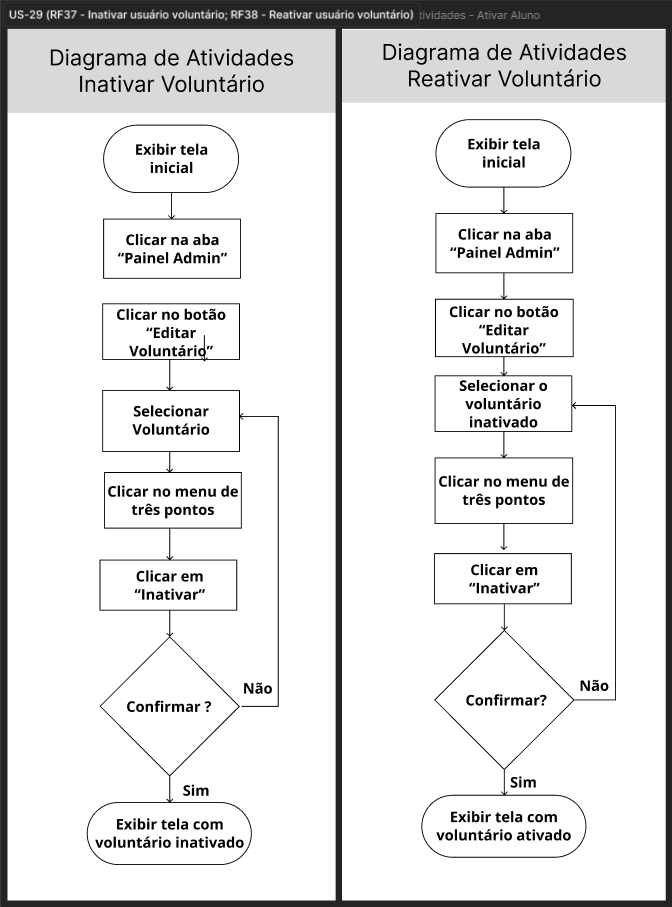
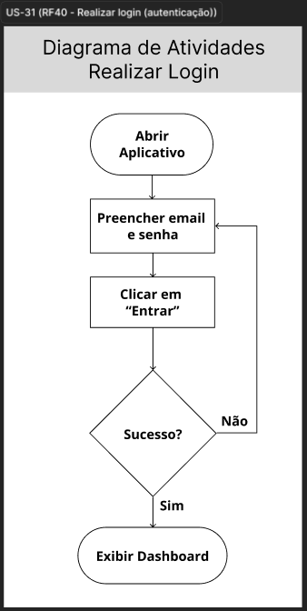

# Evidências — Ciclo 1
**Período:** 21/05/2026 a 29/05/2026
 **Histórias trabalhadas:** [US-28](../USsMVP/US-28.md), [US-29](../USsMVP/US-29.md), [US-31](../USsMVP/US-31.md), [US-32](../USsMVP/US-32.md)

---

## Engenharia de Requisitos { #eng-requisitos }

### Gravações e Atas

| Evidência | Descrição |
| :--- | :--- |
| [Gravação 27/05](../../Atas/reunioes.md#reuniao-r5) | Este vídeo apresenta a validação das atualizações na documentação de DOR (Definition of Ready) e DOD (Definition of Done) com o coordenador do projeto. Durante a reunião, a gerente da equipe explicou os critérios necessários para iniciar e concluir o desenvolvimento das entregas e alinhou os próximos passos, confirmando uma nova reunião conjunta no dia 29 para apresentar a implementação inicial do MVP, focada nas telas de login e cadastro de voluntário. |
| [Ata 27/05](../../Atas/unidade-3.md) | Ata do dia 27/05/2026 com a validação do DoR e DoD com o Coordenador do Projeto Salvando Vidas Através do Esporte |
| [Gravação 29/05](../../Atas/reunioes.md#reuniao-r6) | Este vídeo apresenta a validação da primeira versão do MVP e dos protótipos iniciais com os stakeholders. Durante a reunião, a equipe demonstrou as funcionalidades de login e o cadastro de voluntários, contemplando as histórias de usuário US-28, US-29, US-31 e US-32. |
| [Ata 29/05](../../Atas/unidade-3.md) | Ata do dia 29/05/2026 com a validação da primeira versão do MVP e dos Protótipos Iniciais. |

### Protótipos

=== "Baixa Fidelidade"

    === "US-28"
        

        

    === "US-29"
        

    === "US-31"
        

    === "US-32"
        

=== "Mockups"

    === "US-28"
        

        

    === "US-29"
        

    === "US-31"
        

    === "US-32"
        

---

## Engenharia de Software { #eng-software }

### Diagramas de Atividades

=== "US-28"
    

=== "US-29"
    

=== "US-31"
    

=== "US-32"
    

---

## Definition of Done { #dod }

### Checklist do Ciclo 1

| Critério do DoD | Evidência | Status |
| :--- | :--- | :---: |
| A funcionalidade atende aos critérios de aceitação? | [Issue #28](https://github.com/mdsreq-fga-unb/REQ-2026.1-T02-Salvando-Vidas-atraves-do-Esporte/issues/45) [Issue #29](https://github.com/mdsreq-fga-unb/REQ-2026.1-T02-Salvando-Vidas-atraves-do-Esporte/issues/115) [Issue #31](https://github.com/mdsreq-fga-unb/REQ-2026.1-T02-Salvando-Vidas-atraves-do-Esporte/issues/47) [Issue #32](https://github.com/mdsreq-fga-unb/REQ-2026.1-T02-Salvando-Vidas-atraves-do-Esporte/issues/46) | ✅ |
| O código passou por revisão via Pull Request? | [PR #116](https://github.com/mdsreq-fga-unb/REQ-2026.1-T02-Salvando-Vidas-atraves-do-Esporte/pull/116#event-27458732588) | ✅ |
| Os testes automatizados foram executados e passaram? | [PR #116](https://github.com/mdsreq-fga-unb/REQ-2026.1-T02-Salvando-Vidas-atraves-do-Esporte/pull/116#event-27458732588) | ✅ |
| Os workflows de build foram executados com sucesso? | [Release v1.0.0](https://github.com/mdsreq-fga-unb/REQ-2026.1-T02-Salvando-Vidas-atraves-do-Esporte/releases/tag/v1.0.0) | ✅ |
| A documentação foi atualizada? | [PR #120](https://github.com/mdsreq-fga-unb/REQ-2026.1-T02-Salvando-Vidas-atraves-do-Esporte/pull/120) | ✅ |
| A funcionalidade foi testada e aprovada pelo cliente? | [Gravação](../../Atas/reunioes.md#reuniao-r6) | ✅ |