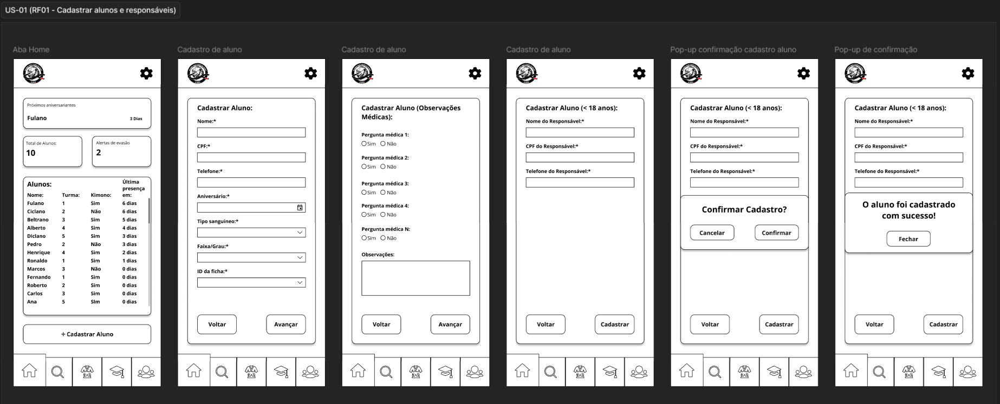
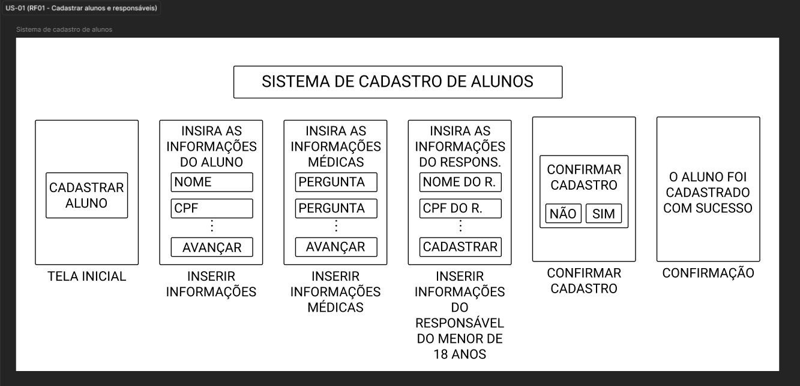
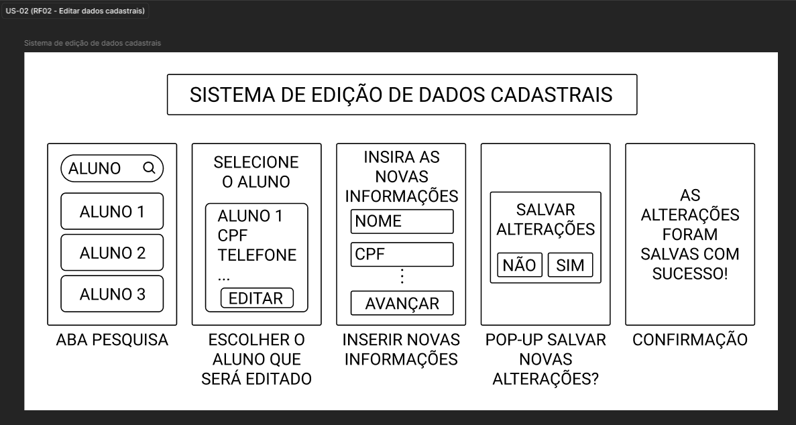
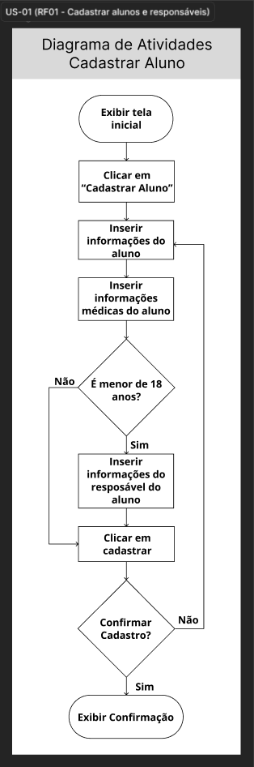
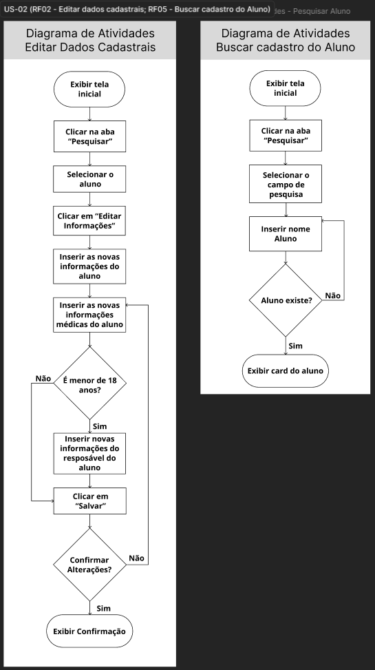
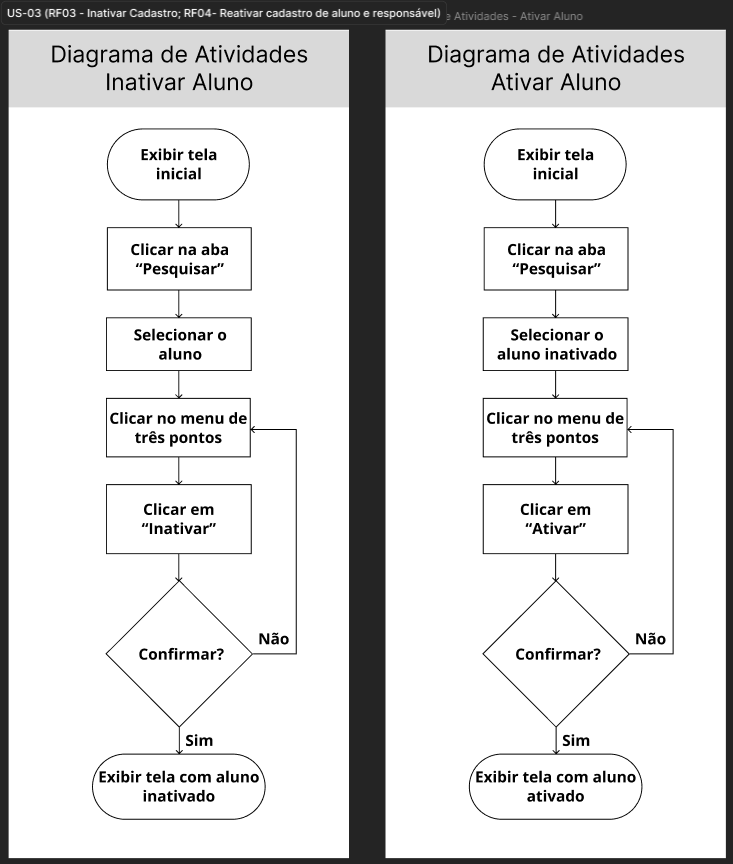

# Evidências — Ciclo 2
**Período:** 29/05/2026 a 03/06/2026  
**Histórias trabalhadas:** [US-01](../USsMVP/US-01.md), [US-02](../USsMVP/US-02.md), [US-03](../USsMVP/US-03.md)

---

## Engenharia de Requisitos { #eng-requisitos }

### Gravações e Atas

| Evidência | Descrição |
| :--- | :--- |
| [Gravação 03/06](../../Atas/reunioes.md#reuniao-r7) | Este vídeo apresenta a reunião de priorização do MVP realizada com a técnica MoSCoW e o apoio visual do Miro. Durante a dinâmica, a equipe e os clientes revisaram as histórias de usuário (US-01, US-02, US-03) e decidiram reduzir a prioridade da funcionalidade de criação de turmas para a categoria 'Should', justificando que ela não é essencial para o lançamento inicial por ser um processo pouco frequente. |
| [Ata 03/06](../../Atas/unidade-3.md) | Ata da reunião do dia 03/06/2026 com a Priorização do MVP utilizando a técnica MoSCoW |

### Protótipos

=== "Baixa Fidelidade"

    === "US-01"
        

    === "US-02"
        

    === "US-03"
        

=== "Mockups"

    === "US-01"
        

    === "US-02"
        

    === "US-03"
        

---

## Engenharia de Software { #eng-software }

### Diagramas de Atividades

=== "US-01"
    

=== "US-02"
    

=== "US-03"
    

---

## Definition of Done { #dod }

### Checklist do Ciclo 2

| Critério do DoD | Evidência | Status |
| :--- | :--- | :---: |
| A funcionalidade atende aos critérios de aceitação? | [Issue #1](https://github.com/mdsreq-fga-unb/REQ-2026.1-T02-Salvando-Vidas-atraves-do-Esporte/issues/40) [Issue #2](https://github.com/mdsreq-fga-unb/REQ-2026.1-T02-Salvando-Vidas-atraves-do-Esporte/issues/106) [Issue #3](https://github.com/mdsreq-fga-unb/REQ-2026.1-T02-Salvando-Vidas-atraves-do-Esporte/issues/41) | ✅ |
| O código passou por revisão via Pull Request? | [PR #116](https://github.com/mdsreq-fga-unb/REQ-2026.1-T02-Salvando-Vidas-atraves-do-Esporte/pull/116#event-27458732588) | ✅ |
| Os testes automatizados foram executados e passaram? | [PR #116](https://github.com/mdsreq-fga-unb/REQ-2026.1-T02-Salvando-Vidas-atraves-do-Esporte/pull/116#event-27458732588) | ✅ |
| Os workflows de build foram executados com sucesso? | [Release v1.0.0](https://github.com/mdsreq-fga-unb/REQ-2026.1-T02-Salvando-Vidas-atraves-do-Esporte/releases/tag/v1.0.0) | ✅ |
| A documentação foi atualizada? | [PR #120](https://github.com/mdsreq-fga-unb/REQ-2026.1-T02-Salvando-Vidas-atraves-do-Esporte/pull/120) | ✅ |
| A funcionalidade foi testada e aprovada pelo cliente? | [Gravação](../../Atas/reunioes.md#reuniao-r7) | ✅ |