# Evidências — Ciclo 3
**Período:** 03/06/2026 a 11/06/2026  
**Histórias trabalhadas:** [US-07](../USsMVP/US-07.md), [US-08](../USsMVP/US-08.md), [US-09](../USsMVP/US-09.md), [US-10](../USsMVP/US-10.md)

---

## Engenharia de Requisitos { #eng-requisitos }

### Gravações e Atas

| Evidência | Descrição |
| :--- | :--- |
| [Gravação 11/06](../../Atas/reunioes.md#reuniao-r8) | Este vídeo registra a validação do MVP com foco na apresentação da identidade visual e dos protótipos de alta fidelidade. Nele, a equipe demonstra a logo oficial e o design detalhado das telas, recebendo sugestões de refinamento visual e de interação por parte dos clientes, que validaram o progresso sem alterações significativas no escopo original. |
| [Ata 11/06](../../Atas/unidade-3.md) | Ata da reunião do dia 11/06/2026 com a validação do MVP com foco na apresentação da identidade visual e dos protótipos de alta fidelidade. |

### Protótipos

=== "Baixa Fidelidade"

    === "US-07"
        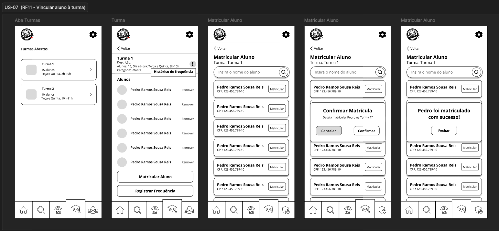

    === "US-08"
        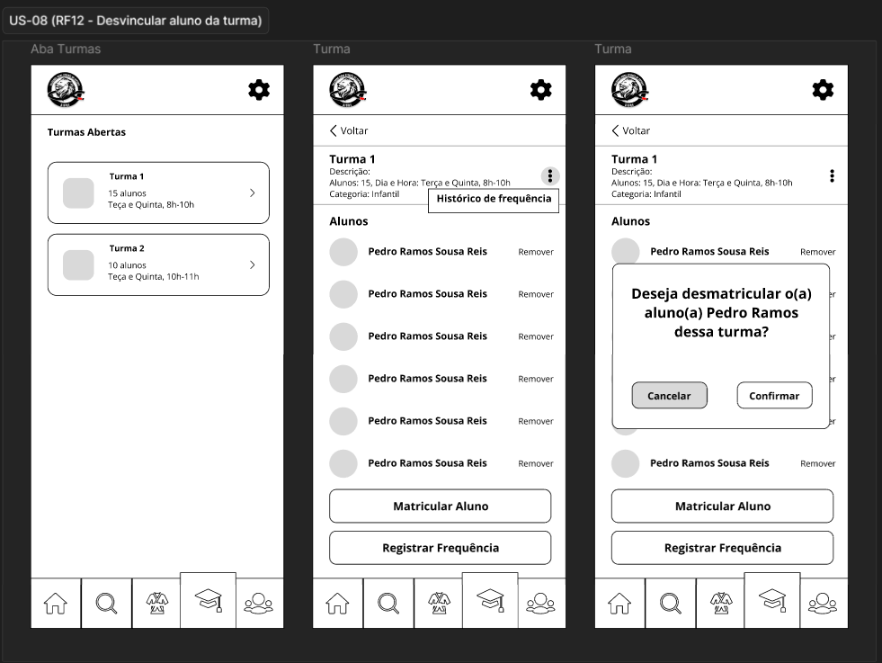

    === "US-09"
        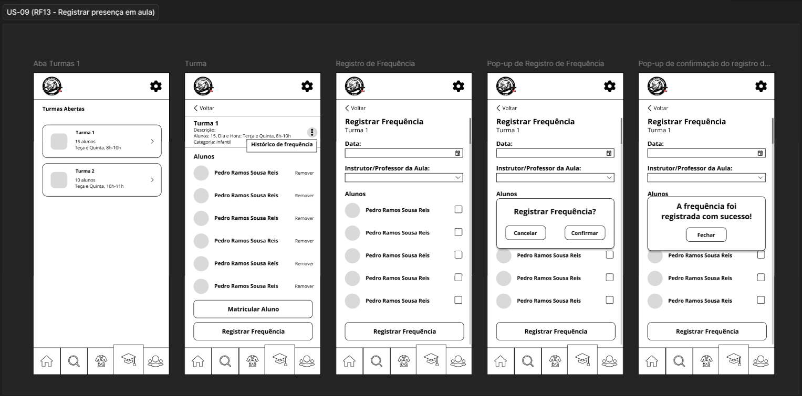

    === "US-10"
        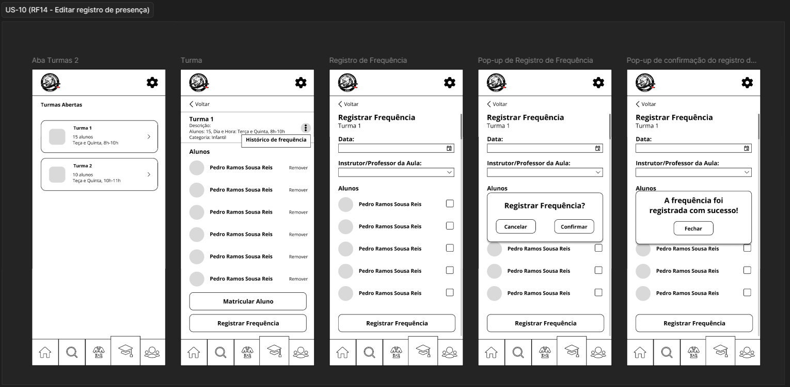

=== "Mockups"

    === "US-07"
        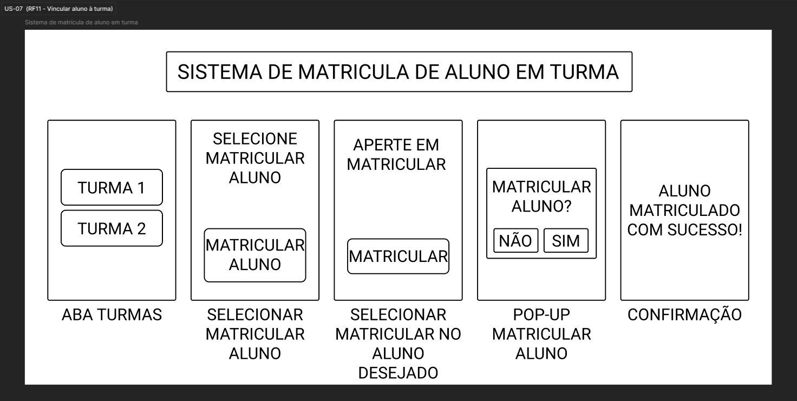

    === "US-08"
        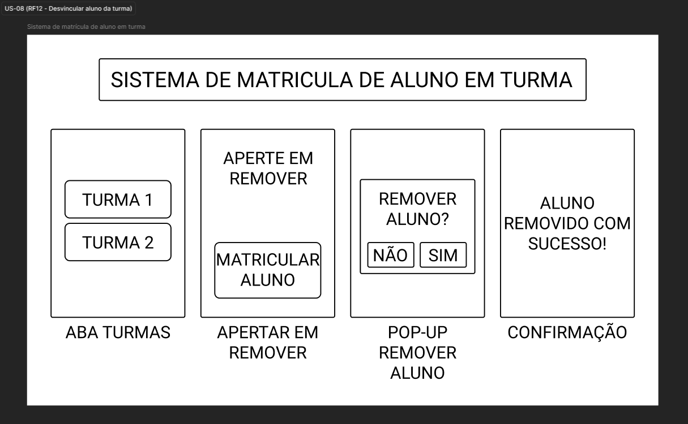

    === "US-09"
        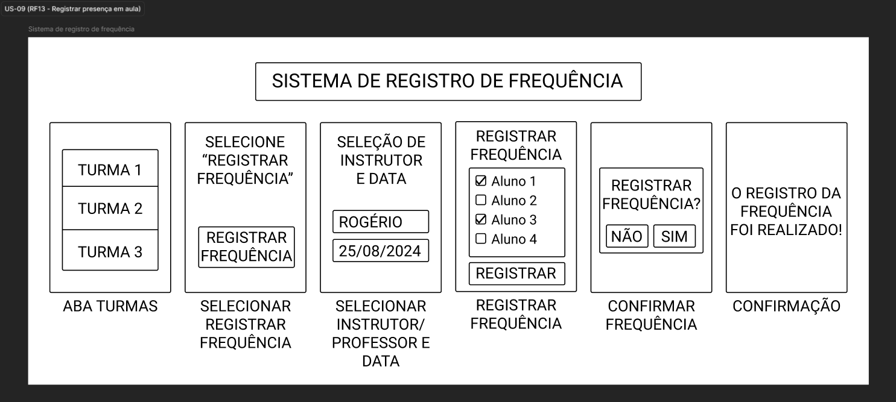

    === "US-10"
        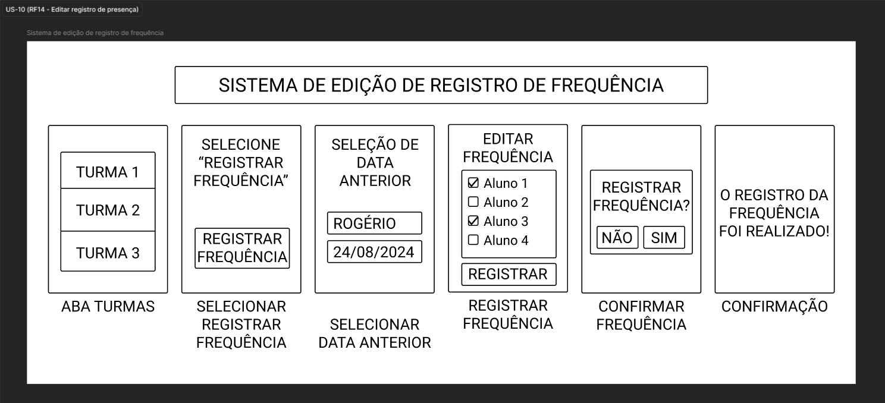

---

## Engenharia de Software { #eng-software }

### Diagramas de Atividades

=== "US-07"
    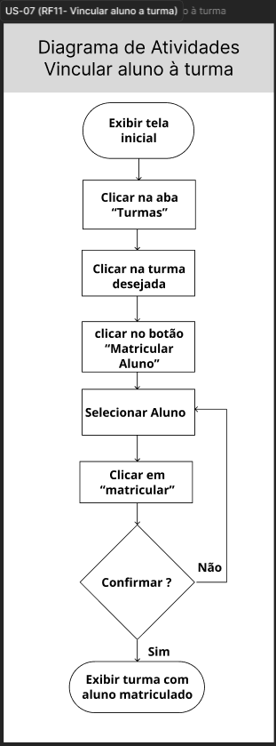

=== "US-08"
    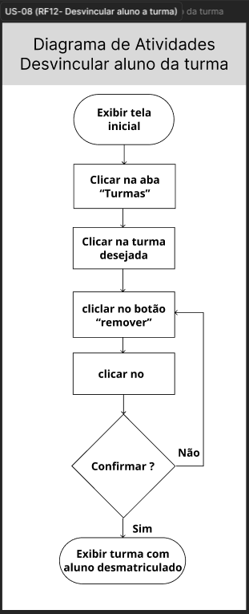

=== "US-09"
    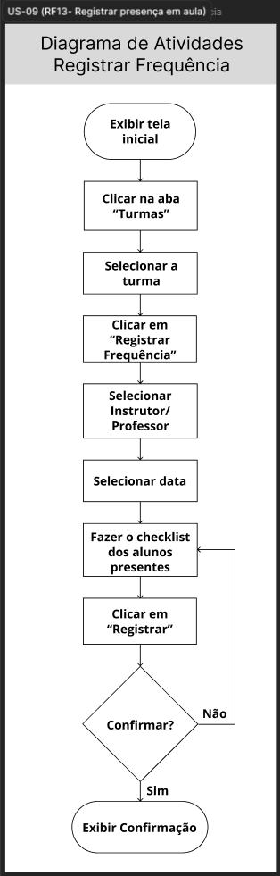

=== "US-10"
    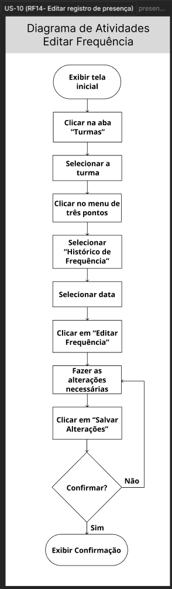

---

## Definition of Done { #dod }

### Checklist do Ciclo 3

| Critério do DoD | Evidência | Status |
| :--- | :--- | :---: |
| A funcionalidade atende aos critérios de aceitação? | [Issue #7](https://github.com/mdsreq-fga-unb/REQ-2026.1-T02-Salvando-Vidas-atraves-do-Esporte/issues/42) [Issue #8](https://github.com/mdsreq-fga-unb/REQ-2026.1-T02-Salvando-Vidas-atraves-do-Esporte/issues/107) [Issue #9](https://github.com/mdsreq-fga-unb/REQ-2026.1-T02-Salvando-Vidas-atraves-do-Esporte/issues/43) [Issue #10](https://github.com/mdsreq-fga-unb/REQ-2026.1-T02-Salvando-Vidas-atraves-do-Esporte/issues/108) | ✅ |
| O código passou por revisão via Pull Request? | [PR #116](https://github.com/mdsreq-fga-unb/REQ-2026.1-T02-Salvando-Vidas-atraves-do-Esporte/pull/116#event-27458732588) | ✅ |
| Os testes automatizados foram executados e passaram? | [PR #116](https://github.com/mdsreq-fga-unb/REQ-2026.1-T02-Salvando-Vidas-atraves-do-Esporte/pull/116#event-27458732588) | ✅ |
| Os workflows de build foram executados com sucesso? | [Release v1.0.0](https://github.com/mdsreq-fga-unb/REQ-2026.1-T02-Salvando-Vidas-atraves-do-Esporte/releases/tag/v1.0.0) | ✅ |
| A documentação foi atualizada? | [PR #120](https://github.com/mdsreq-fga-unb/REQ-2026.1-T02-Salvando-Vidas-atraves-do-Esporte/pull/120) | ✅ |
| A funcionalidade foi testada e aprovada pelo cliente? | [Gravação](../../Atas/reunioes.md#reuniao-r8) | ✅ |