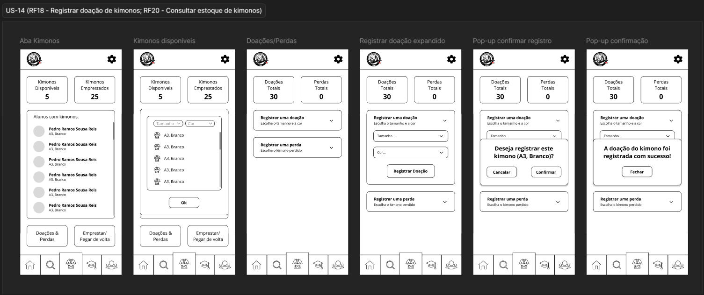
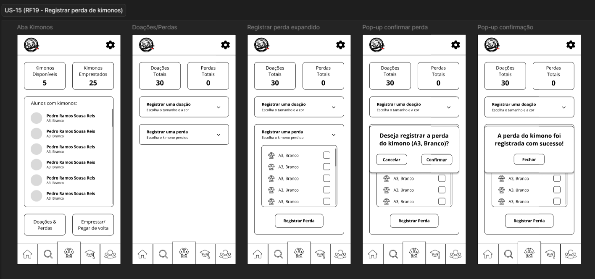
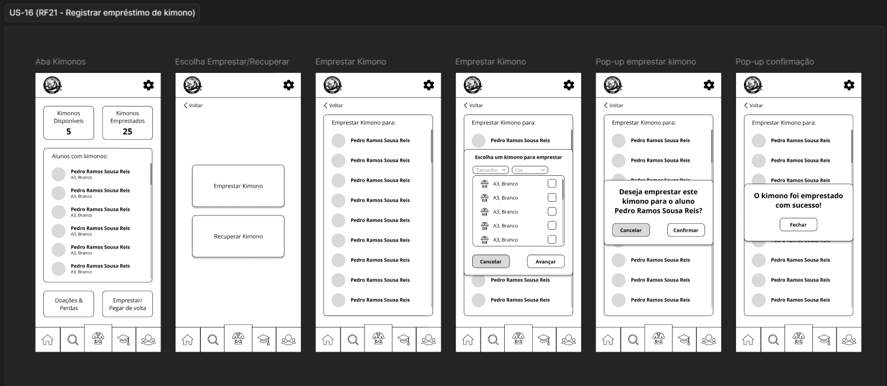
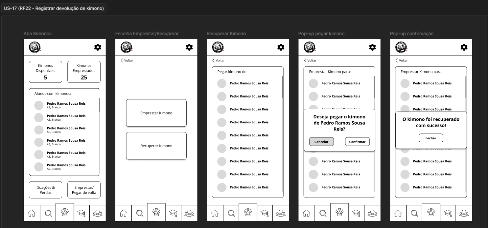
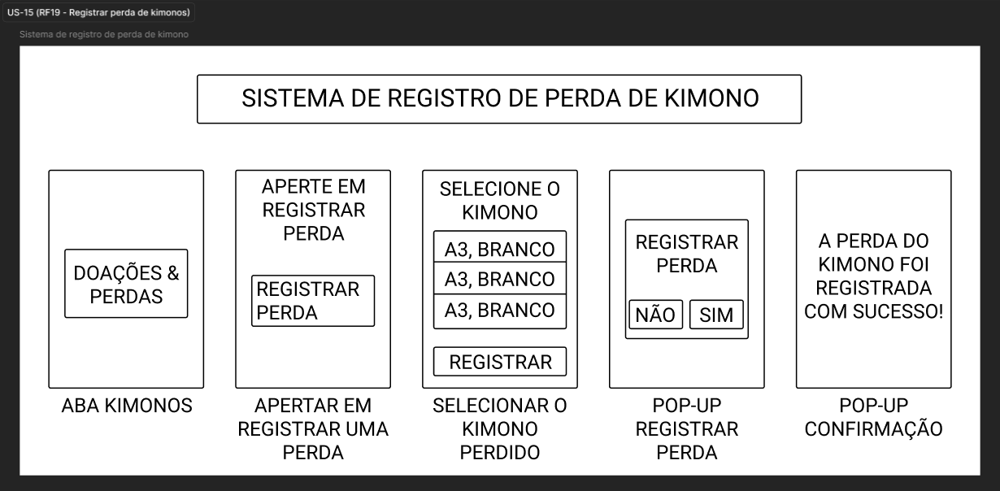
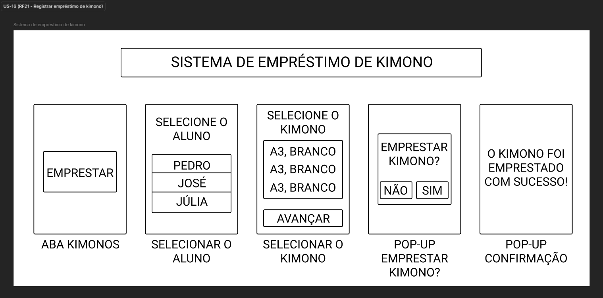
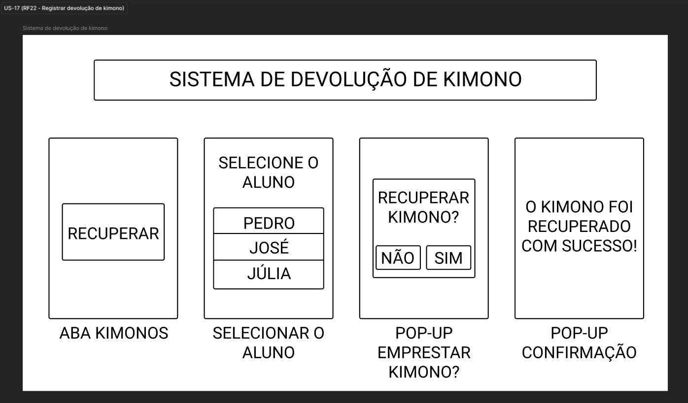
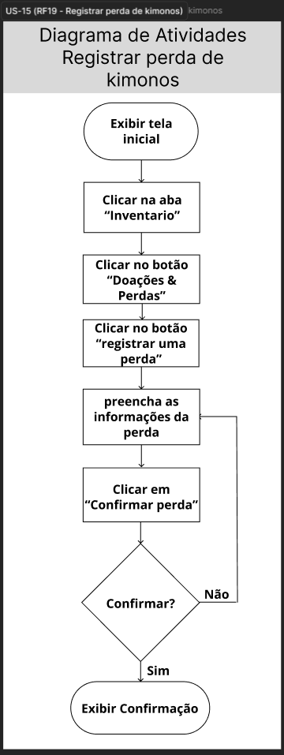
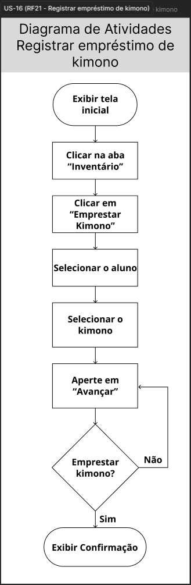
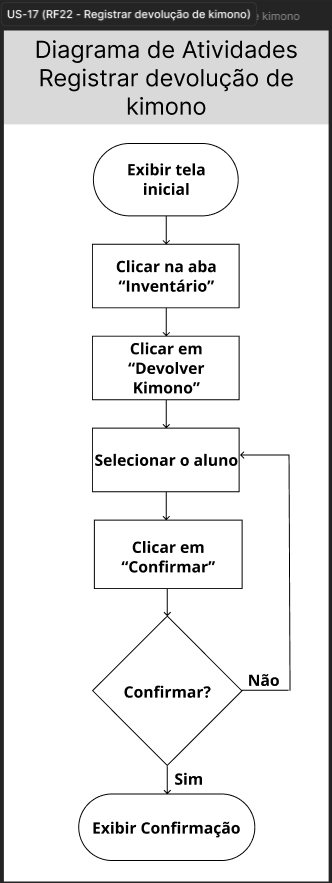

# Evidências — Ciclo 4
**Período:** 11/06/2026 a 26/06/2026  
**Histórias trabalhadas:** [US-14](../USsMVP/US-14.md), [US-15](../USsMVP/US-15.md), [US-16](../USsMVP/US-16.md), [US-17](../USsMVP/US-17.md)

---

## Engenharia de Requisitos { #eng-requisitos }

### Gravações e Atas

| Evidência | Descrição |
| :--- | :--- |
| [Gravação 26/06](../../Atas/reunioes.md#reuniao-r9) | Este vídeo apresenta a validação das implementações dos ciclos 4 e 5, abrangendo as histórias de usuário US-14, US-15, US-16, US-17, todas essas referentes ao Ciclo 4. Durante a reunião, a equipe demonstrou a terceira versão do aplicativo e os protótipos, que foram aceitos pelos stakeholders sem necessidade de alterações, ficando pendente apenas a história US-12, referente ao histórico de frequência, para o próximo e último ciclo de desenvolvimento. |
| [Ata 26/06](../../Atas/unidade-4.md) | Ata da reunião do dia 26/06/2026 com a validação das implementações dos ciclos 4 e 5, abrangendo as histórias de usuário US-14, US-15, US-16 e US-17. |

### Protótipos

=== "Baixa Fidelidade"

    === "US-14"
        

    === "US-15"
        

    === "US-16"
        

    === "US-17"
        

=== "Mockups"

    === "US-14"
        

    === "US-15"
        

    === "US-16"
        

    === "US-17"
        

---

## Engenharia de Software { #eng-software }

### Diagramas de Atividades

=== "US-14"
    

=== "US-15"
    

=== "US-16"
    

=== "US-17"
    

---

## Definition of Done { #dod }

### Checklist do Ciclo 4

| Critério do DoD | Evidência | Status |
| :--- | :--- | :---: |
| A funcionalidade atende aos critérios de aceitação? | [Issue #14](https://github.com/mdsreq-fga-unb/REQ-2026.1-T02-Salvando-Vidas-atraves-do-Esporte/issues/111) [Issue #15](https://github.com/mdsreq-fga-unb/REQ-2026.1-T02-Salvando-Vidas-atraves-do-Esporte/issues/112) [Issue #16](https://github.com/mdsreq-fga-unb/REQ-2026.1-T02-Salvando-Vidas-atraves-do-Esporte/issues/113) [Issue #17](https://github.com/mdsreq-fga-unb/REQ-2026.1-T02-Salvando-Vidas-atraves-do-Esporte/issues/113) | ✅ |
| O código passou por revisão via Pull Request? | [PR #116](https://github.com/mdsreq-fga-unb/REQ-2026.1-T02-Salvando-Vidas-atraves-do-Esporte/pull/116#event-27458732588) | ✅ |
| Os testes automatizados foram executados e passaram? | [PR #116](https://github.com/mdsreq-fga-unb/REQ-2026.1-T02-Salvando-Vidas-atraves-do-Esporte/pull/116#event-27458732588) | ✅ |
| Os workflows de build foram executados com sucesso? | [Release v1.0.0](https://github.com/mdsreq-fga-unb/REQ-2026.1-T02-Salvando-Vidas-atraves-do-Esporte/releases/tag/v1.0.0) | ✅ |
| A documentação foi atualizada? | [PR #120](https://github.com/mdsreq-fga-unb/REQ-2026.1-T02-Salvando-Vidas-atraves-do-Esporte/pull/120) | ✅ |
| A funcionalidade foi testada e aprovada pelo cliente? | [Gravação](../../Atas/reunioes.md#reuniao-r9) | ✅ |