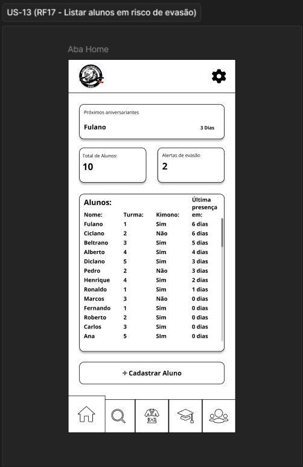
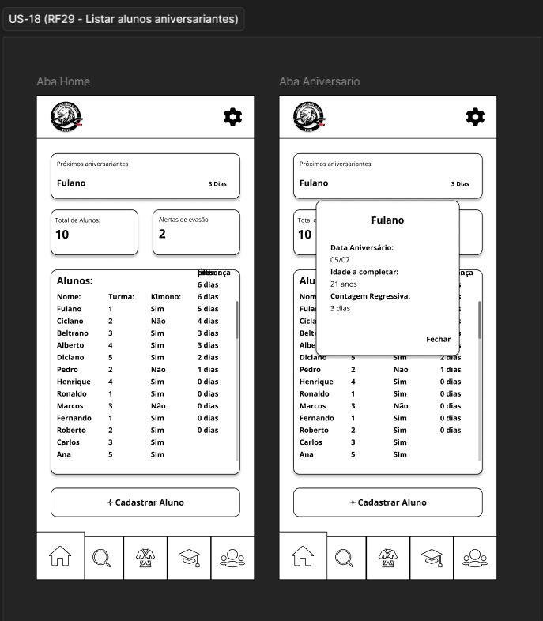
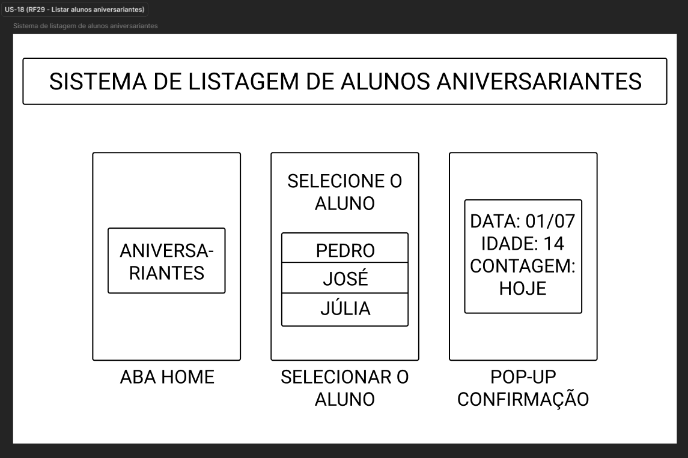
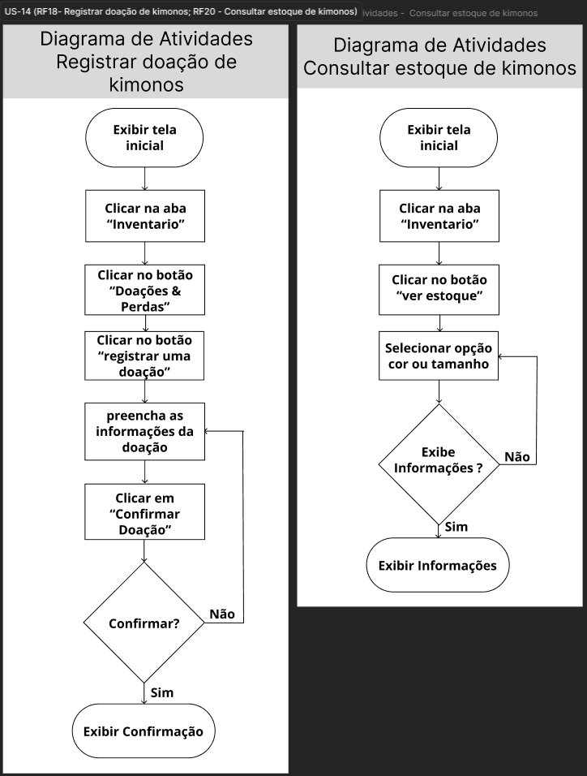

# Evidências — Ciclo 5
**Período:** 16/06/2026 a 26/06/2026  
**Histórias trabalhadas:** [US-13](../USsMVP/US-13.md), [US-18](../USsMVP/US-18.md)

---

## Engenharia de Requisitos { #eng-requisitos }

### Gravações e Atas

| Evidência | Descrição |
| :--- | :--- |
| [Gravação 26/06](../../Atas/reunioes.md#reuniao-r9) | Este vídeo apresenta a validação das implementações dos ciclos 4 e 5, abrangendo as histórias de usuário US-13 e US-18, referentes ao Ciclo 5. Durante a reunião, a equipe demonstrou a terceira versão do aplicativo e os protótipos, que foram aceitos pelos stakeholders sem necessidade de alterações, ficando pendente apenas a história US-12, referente ao histórico de frequência, para o próximo e último ciclo de desenvolvimento. |
| [Ata 26/06](../../Atas/unidade-4.md) | Ata da reunião do dia 26/06/2026 com a validação das implementações dos ciclos 4 e 5, abrangendo as histórias de usuário US-13 e US-18. |

### Protótipos

=== "Baixa Fidelidade"

    === "US-13"
        

    === "US-18"
        

=== "Mockups"

    === "US-13"
        

    === "US-18"
        

---

## Engenharia de Software { #eng-software }

### Diagramas de Atividades

=== "US-13"
    

=== "US-18"
    

---

## Definition of Done { #dod }

### Checklist do Ciclo 5

| Critério do DoD | Evidência | Status |
| :--- | :--- | :---: |
| A funcionalidade atende aos critérios de aceitação? | [Issue #13](https://github.com/mdsreq-fga-unb/REQ-2026.1-T02-Salvando-Vidas-atraves-do-Esporte/issues/110) [Issue #18](https://github.com/mdsreq-fga-unb/REQ-2026.1-T02-Salvando-Vidas-atraves-do-Esporte/issues/44) | ✅ |
| O código passou por revisão via Pull Request? | [PR #116](https://github.com/mdsreq-fga-unb/REQ-2026.1-T02-Salvando-Vidas-atraves-do-Esporte/pull/116#event-27458732588) | ✅ |
| Os testes automatizados foram executados e passaram? | [PR #116](https://github.com/mdsreq-fga-unb/REQ-2026.1-T02-Salvando-Vidas-atraves-do-Esporte/pull/116#event-27458732588) | ✅ |
| Os workflows de build foram executados com sucesso? | [Release v1.0.0](https://github.com/mdsreq-fga-unb/REQ-2026.1-T02-Salvando-Vidas-atraves-do-Esporte/releases/tag/v1.0.0) | ✅ |
| A documentação foi atualizada? | [PR #120](https://github.com/mdsreq-fga-unb/REQ-2026.1-T02-Salvando-Vidas-atraves-do-Esporte/pull/120) | ✅ |
| A funcionalidade foi testada e aprovada pelo cliente? | [Gravação](../../Atas/reunioes.md#reuniao-r9) | ✅ |