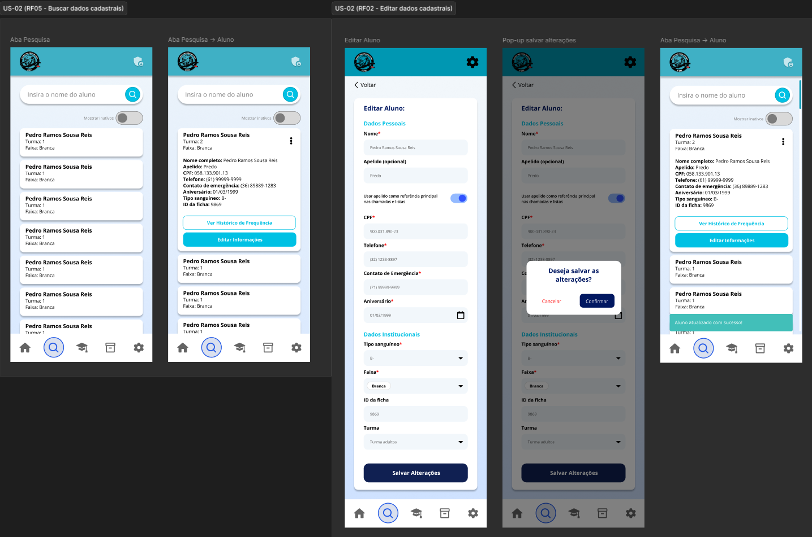

# US-02 — Edição e Busca de Aluno

!!! quote "História de Usuário"
    > *"Como **Coordenador**, quero editar e buscar dados de alunos, para manter o cadastro sempre atualizado e localizar registros com facilidade."*
    > 
    > **Requisito Relacionado:** [RF02](../../Visão%20do%20Produto%20e%20Projeto/requisitosDeSoftware.md#rf02) [RF05](../../Visão%20do%20Produto%20e%20Projeto/requisitosDeSoftware.md#rf05)

---

### Rota no App

!!! info "Navegação passo a passo"
  - **Edição:** `Menu Principal` ➔ `Pesquisar` ➔ Expandir Card do Aluno ➔ Botão **"Editar Informações"** ➔ Botão **"Salvar Alterações"** ➔ Modal *Confirmação* ➔ Botão **"Confirmar"**
  - **Busca:** `Menu Principal` ➔ `Pesquisar` ➔ Barra de Pesquisa
  - **Inativação:** `Menu Principal` ➔ `Pesquisar` ➔ Expandir Card do Aluno ➔ Menu Opções (⋮) ➔ Opção **"Inativar"**

---

### Critérios de Aceitação

- [x] O sistema deve permitir a edição dos dados cadastrais do aluno a qualquer momento.
- [x] O sistema deve solicitar confirmação antes de realizar a inativação do cadastro do aluno, sem excluir suas informações.
- [x] Cadastros inativos não devem ser exibidos nas listagens de alunos ativos.

---

### Protótipos de Média Fidelidade

---

!!! check "Definition of Ready (DoR)"
    - [x] O requisito está devidamente documentado?
    - [x] O requisito é viável em termos de tempo e complexidade?
    - [x] O requisito foi priorizado?
    - [x] O requisito está claro e delimitado?
    - [x] A User Story foi prototipada?
    - [x] A User Story é testável e rastreável?
    - [x] A User Story foi validada pelo cliente?
