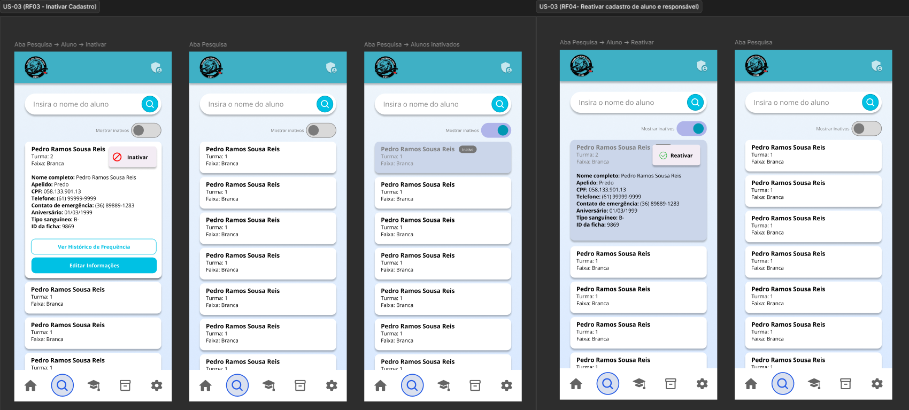

# US-03 — Inativação e Reativação de Aluno

!!! quote "História de Usuário"
    > *"Como **Coordenador**, quero inativar ou reativar o cadastro de um aluno, para controlar quem está ativo no projeto sem perder o histórico registrado."*
    > 
    > **Requisito Relacionado:** [RF03](../../Visão%20do%20Produto%20e%20Projeto/requisitosDeSoftware.md#rf03) [RF04](../../Visão%20do%20Produto%20e%20Projeto/requisitosDeSoftware.md#rf04)

---

### Rota no App

!!! info "Navegação passo a passo"
    - `Menu Principal` ➔ `Pesquisar` ➔ Ativar Filtro *Inativos* ➔ Expandir Card do Aluno ➔ Menu Opções (⋮) ➔ Opção **"Reativar"**

---

### Critérios de Aceitação

- [x] O sistema deve solicitar confirmação antes de realizar a inativação do cadastro do aluno, sem excluir suas informações.
- [x] Cadastros inativos não devem ser exibidos nas listagens de alunos ativos.
- [x] O sistema deve permitir a localização de alunos com cadastro inativo.
- [x] Após a reativação, o cadastro do aluno deve retornar ao status "Ativo" e voltar a ser exibido nas listagens do sistema.
- [x] O sistema deve preservar todo o histórico e as informações previamente cadastradas do aluno após a reativação.

---

### Protótipos de Média Fidelidade

---

!!! check "Definition of Ready (DoR)"
    - [x] O requisito está devidamente documentado?
    - [x] O requisito é viável em termos de tempo e complexidade?
    - [x] O requisito foi priorizado?
    - [x] O requisito está claro e delimitado?
    - [x] A User Story foi prototipada?
    - [x] A User Story é testável e rastreável?
    - [x] A User Story foi validada pelo cliente?
