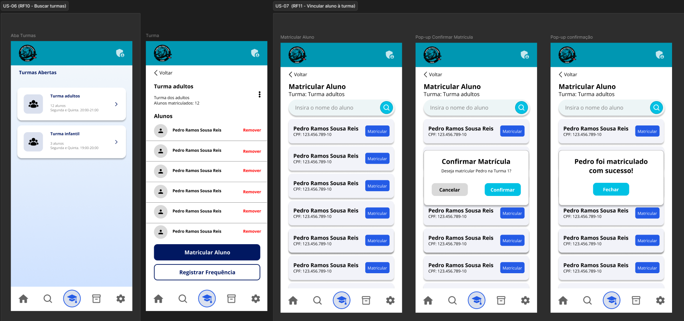

# US-07 — Matrícula de Aluno em Turma

!!! quote "História de Usuário"
    > *"Como **Coordenador**, quero matricular um aluno em uma turma, para que ele apareça nas listas de chamada corretas."*
    > 
    > **Requisito Relacionado:** [RF11](../../Visão%20do%20Produto%20e%20Projeto/requisitosDeSoftware.md#rf11)

---

### Rota no App

!!! info "Navegação passo a passo"
    - `Menu Principal` ➔ `Turmas` ➔ Selecionar Card da Turma ➔ Botão **"Matricular Aluno"** ➔ Selecionar Aluno na Lista ➔ Botão **"Matricular"** ➔ Modal *Confirmação* ➔ Botão **"Confirmar"**

---

### Critérios de Aceitação

- [x] O sistema deve permitir a matrícula apenas de alunos com cadastro ativo.
- [x] Após a matrícula, o aluno deve ser incluído automaticamente na lista de chamada da turma correspondente.
- [x] O sistema não deve permitir que um aluno possua matrícula ativa em mais de uma turma simultaneamente.

---

### Protótipos de Média Fidelidade

---

!!! check "Definition of Ready (DoR)"
    - [x] O requisito está devidamente documentado?
    - [x] O requisito é viável em termos de tempo e complexidade?
    - [x] O requisito foi priorizado?
    - [x] O requisito está claro e delimitado?
    - [x] A User Story foi prototipada?
    - [x] A User Story é testável e rastreável?
    - [x] A User Story foi validada pelo cliente?
