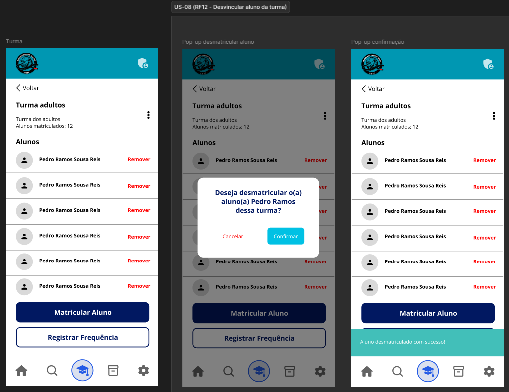

# US-08 — Cancelamento de Matrícula

!!! quote "História de Usuário"
    > *"Como **Coordenador**, quero cancelar a matrícula de um aluno em uma turma, para que a chamada reflita apenas quem frequenta ativamente."*
    > 
    > **Requisito Relacionado:** [RF12](../../Visão%20do%20Produto%20e%20Projeto/requisitosDeSoftware.md#rf12)

---

### Rota no App

!!! info "Navegação passo a passo"
    - `Menu Principal` ➔ `Turmas` ➔ Selecionar Card da Turma ➔ Lista de Alunos ➔ Botão **"Remover"** ➔ Modal *Confirmação* ➔ Botão **"Confirmar"**

---

### Critérios de Aceitação

- [x] O sistema deve solicitar confirmação antes de concluir o cancelamento da matrícula do aluno.
- [x] Após o cancelamento da matrícula, o aluno não deve aparecer nas listas de chamada futuras da turma.
- [x] O sistema deve preservar o histórico de presença anterior ao cancelamento, caso o aluno seja matriculado novamente na mesma turma.

---

### Protótipos de Média Fidelidade

---

!!! check "Definition of Ready (DoR)"
    - [x] O requisito está devidamente documentado?
    - [x] O requisito é viável em termos de tempo e complexidade?
    - [x] O requisito foi priorizado?
    - [x] O requisito está claro e delimitado?
    - [x] A User Story foi prototipada?
    - [x] A User Story é testável e rastreável?
    - [x] A User Story foi validada pelo cliente?
