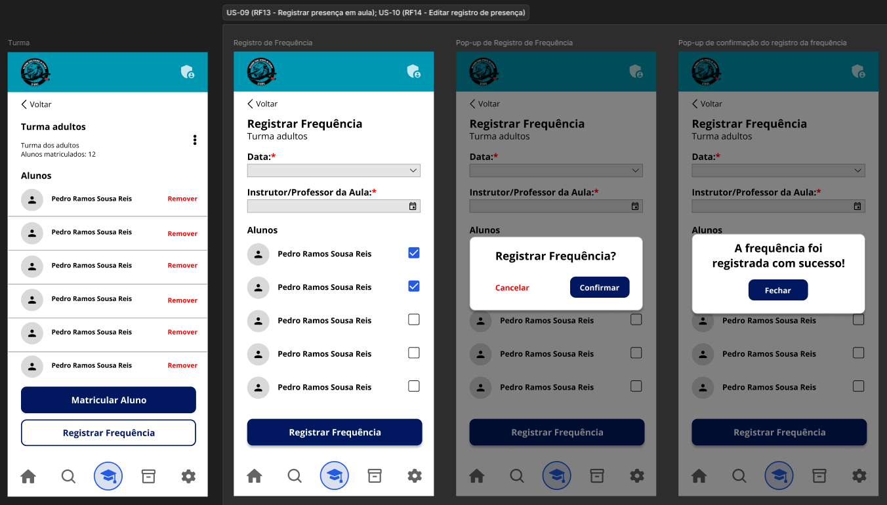

# US-09 — Registro de Presença em Aula

!!! quote "História de Usuário"
    > *"Como **Voluntário**, quero registrar a presença dos alunos de forma ágil, para fechar a chamada ainda durante a aula."*
    > 
    > **Requisito Relacionado:** [RF13](../../Visão%20do%20Produto%20e%20Projeto/requisitosDeSoftware.md#rf13)

---

### Rota no App

!!! info "Navegação passo a passo"
    - `Menu Principal` ➔ `Turmas` ➔ Selecionar Card da Turma ➔ Botão **"Registrar Frequência"** ➔ Marcar Presenças nos Checkboxes ➔ Botão **"Registrar Frequência"** ➔ Modal *Confirmação* ➔ Botão **"Confirmar"**

---

### Critérios de Aceitação

- [x] O sistema deve exibir a lista de alunos matriculados na turma para realização da chamada.
- [x] O sistema deve exigir que um instrutor ou professor esteja vinculado ao registro de frequência da aula.
- [x] O sistema não deve permitir o registro de presença para datas futuras.

---

### Protótipos de Média Fidelidade

---

!!! check "Definition of Ready (DoR)"
    - [x] O requisito está devidamente documentado?
    - [x] O requisito é viável em termos de tempo e complexidade?
    - [x] O requisito foi priorizado?
    - [x] O requisito está claro e delimitado?
    - [x] A User Story foi prototipada?
    - [x] A User Story é testável e rastreável?
    - [x] A User Story foi validada pelo cliente?
