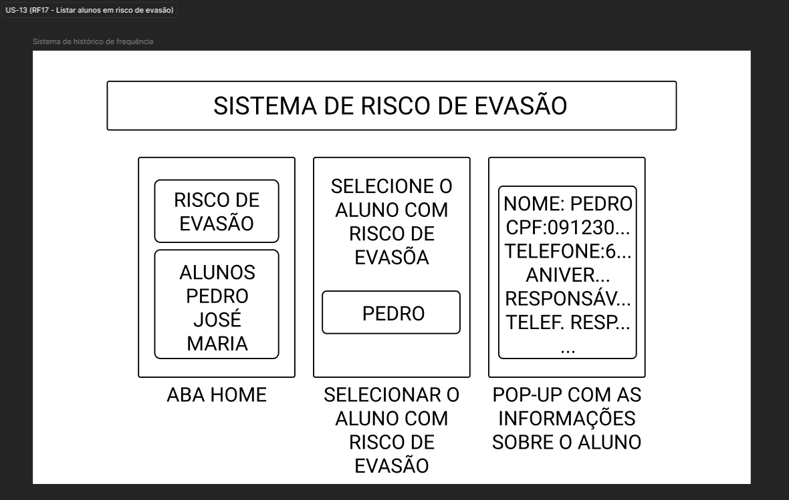

# US-13 — Monitoramento de Risco de Evasão

!!! quote "História de Usuário"
    > *"Como **Coordenador**, quero acompanhar alertas visuais de inatividade diretamente no painel principal, para agir de forma proativa junto às famílias antes que o aluno abandone o projeto."*
    > 
    > **Requisito Relacionado:** [RF17](../../Visão%20do%20Produto%20e%20Projeto/requisitosDeSoftware.md#rf17)

---

### Rota no App

!!! info "Navegação passo a passo"
    - **Verificação de Alerta:** `Menu Principal` ➔ `Início` ➔ Verificar contador no card *Alertas de Evasão* ➔ Consultar na tabela *Alunos Ativos* os alunos com status em vermelho na coluna *Última presença*
    - **Detalhes do Aluno em Risco:** `Menu Principal` ➔ `Início` ➔ Tabela *Alunos Ativos* ➔ Clicar sobre a linha do aluno com alerta ➔ Modal *Informações do Aluno*

---

### Critérios de Aceitação

- [x] O sistema deve exibir no painel principal um contador com o total de alunos que possuem duas ou mais semanas consecutivas de ausência.
- [x] O sistema deve aplicar um destaque visual aos alunos identificados como em risco de evasão nas listagens gerais.
- [x] O destaque visual deve ser removido automaticamente após o registro de uma nova presença do aluno.

---

### Protótipos de Média Fidelidade

---

!!! check "Definition of Ready (DoR)"
    - [x] O requisito está devidamente documentado?
    - [x] O requisito é viável em termos de tempo e complexidade?
    - [x] O requisito foi priorizado?
    - [x] O requisito está claro e delimitado?
    - [x] A User Story foi prototipada?
    - [x] A User Story é testável e rastreável?
    - [x] A User Story foi validada pelo cliente?
