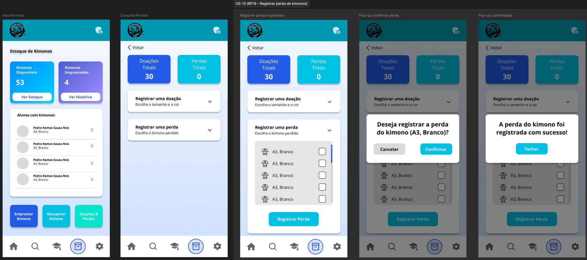

# US-15 — Registro de Perda ou Dano de Kimono

!!! quote "História de Usuário"
    > *"Como **Coordenador**, quero registrar a perda ou dano em kimonos, para que o estoque reflita apenas o que pode ser emprestado."*
    > 
    > **Requisito Relacionado:** [RF19](../../Visão%20do%20Produto%20e%20Projeto/requisitosDeSoftware.md#rf19)

---

### Rota no App

!!! info "Navegação passo a passo"
    - `Menu Principal` ➔ `Inventário` ➔ Botão **"Doações & Perdas"** ➔ Card Expansível *Registrar uma perda* ➔ Preencher Kimono, Quantidade e Motivo ➔ Botão **"Confirmar Perda"** ➔ Modal *Confirmação* ➔ Botão **"Confirmar"**

---

### Critérios de Aceitação

- [x] O sistema deve exigir a seleção do kimono danificado ou perdido antes do registro da ocorrência.
- [x] O sistema deve solicitar o motivo da perda ou dano e a quantidade de itens afetados.
- [x] O sistema deve concluir o registro apenas quando todos os campos obrigatórios estiverem preenchidos.

---

### Protótipos de Média Fidelidade

---

!!! check "Definition of Ready (DoR)"
    - [x] O requisito está devidamente documentado?
    - [x] O requisito é viável em termos de tempo e complexidade?
    - [x] O requisito foi priorizado?
    - [x] O requisito está claro e delimitado?
    - [x] A User Story foi prototipada?
    - [x] A User Story é testável e rastreável?
    - [x] A User Story foi validada pelo cliente?
