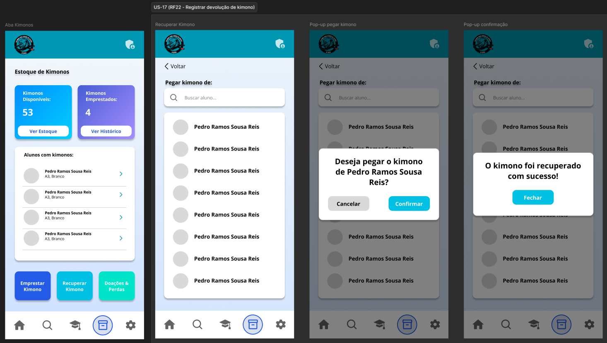

# US-17 — Registro de Devolução de Kimono

!!! quote "História de Usuário"
    > *"Como **Coordenador**, quero registrar a devolução de um kimono, para reintegrá-lo ao estoque disponível para empréstimo."*
    > 
    > **Requisito Relacionado:** [RF22](../../Visão%20do%20Produto%20e%20Projeto/requisitosDeSoftware.md#rf22)

---

### Rota no App

!!! info "Navegação passo a passo"
    - `Menu Principal` ➔ `Inventário` ➔ Botão **"Devolver Kimono"** ➔ Selecionar Aluno na Lista ➔ Modal *Confirmação* ➔ Botão **"Confirmar"**

---

### Critérios de Aceitação

- [x] O sistema deve reintegrar automaticamente o kimono ao estoque disponível após o registro da devolução.
- [x] O sistema não deve permitir o registro da devolução de um kimono que não possua empréstimo ativo.
- [x] O sistema deve exibir a lista de alunos com empréstimos ativos para seleção durante o processo de devolução.

---

### Protótipos de Média Fidelidade

---

!!! check "Definition of Ready (DoR)"
    - [x] O requisito está devidamente documentado?
    - [x] O requisito é viável em termos de tempo e complexidade?
    - [x] O requisito foi priorizado?
    - [x] O requisito está claro e delimitado?
    - [x] A User Story foi prototipada?
    - [x] A User Story é testável e rastreável?
    - [x] A User Story foi validada pelo cliente?
