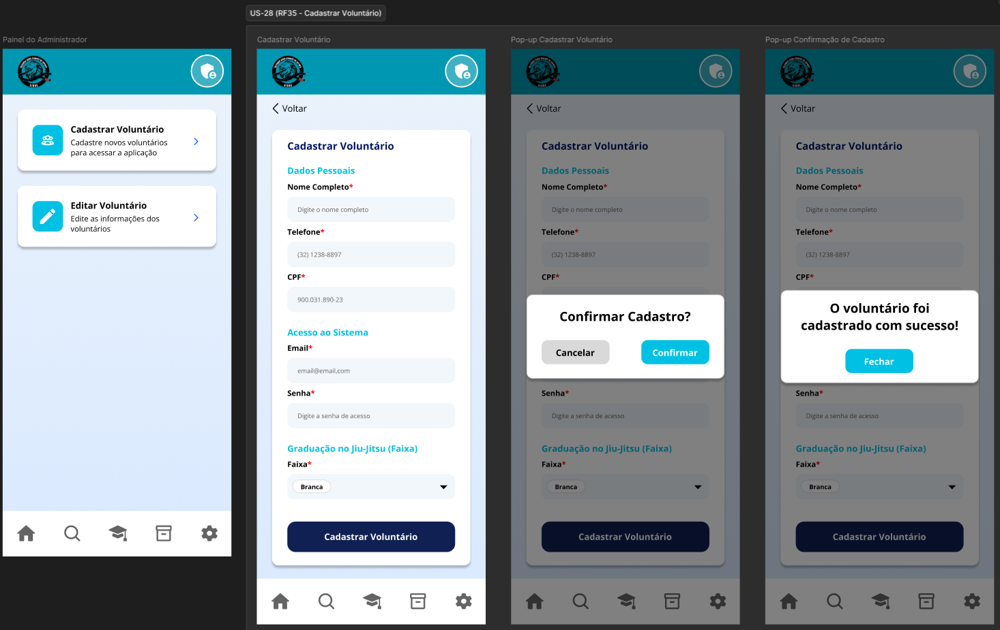

# US-28 — Cadastro e Edição de Voluntários

!!! quote "História de Usuário"
    > *"Como **Coordenador**, quero cadastrar e editar voluntários com senhas protegidas, para manter os perfis da equipe sempre atualizados e seguros."*
    > 
    > **Requisito Relacionado:** [RF35](../../Visão%20do%20Produto%20e%20Projeto/requisitosDeSoftware.md#rf35) [RF36](../../Visão%20do%20Produto%20e%20Projeto/requisitosDeSoftware.md#rf36)

---

### Rota no App

!!! info "Navegação passo a passo"
    - **Cadastro:** `Menu Principal` ➔ `Configurações` ➔ Acesso Painel Admin (`/admin`) ➔ Card *Cadastrar Voluntário* ➔ Preencher Formulário ➔ Botão **"Salvar"**
    - **Edição:** `Menu Principal` ➔ `Configurações` ➔ Acesso Painel Admin (`/admin`) ➔ Card *Editar Voluntário* ➔ Selecionar Voluntário ➔ Botão **"Salvar"**

---

### Critérios de Aceitação

- [x] O sistema deve permitir o cadastro de voluntários contendo, no mínimo, os campos: nome, CPF, telefone de contato, telefone de emergência, e-mail e faixa de graduação.
- [x] O sistema deve validar o preenchimento dos campos obrigatórios antes de concluir o cadastro do voluntário.
- [x] O sistema deve permitir a edição dos dados do voluntário a qualquer momento, exceto do CPF, que deve permanecer imutável após o cadastro.

---

### Protótipos de Média Fidelidade

---

!!! check "Definition of Ready (DoR)"
    - [x] O requisito está devidamente documentado?
    - [x] O requisito é viável em termos de tempo e complexidade?
    - [x] O requisito foi priorizado?
    - [x] O requisito está claro e delimitado?
    - [x] A User Story foi prototipada?
    - [x] A User Story é testável e rastreável?
    - [x] A User Story foi validada pelo cliente?
