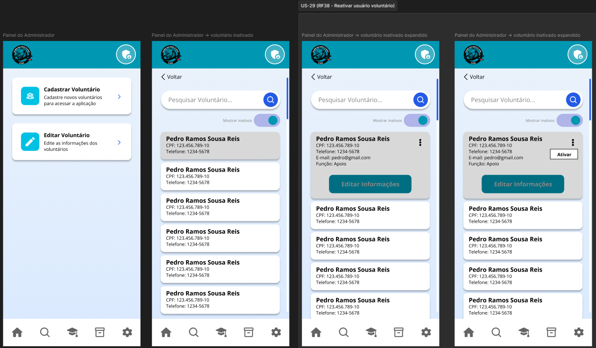

# US-29 — Inativação e Reativação de Voluntários

!!! quote "História de Usuário"
    > *"Como **Coordenador**, quero gerenciar o status de atividade dos voluntários (inativar ou reativar), para controlar quem tem acesso ao sistema sem perder o histórico de suas ações."*
    > 
    > **Requisito Relacionado:** [RF37](../../Visão%20do%20Produto%20e%20Projeto/requisitosDeSoftware.md#rf37) [RF38](../../Visão%20do%20Produto%20e%20Projeto/requisitosDeSoftware.md#rf38)

---

### Rota no App

!!! info "Navegação passo a passo"
    - **Inativação / Reativação:** `Menu Principal` ➔ `Configurações` ➔ Acesso Painel Admin (`/admin`) ➔ Card *Editar Voluntário* ➔ Lista de Voluntários ➔ Menu Opções (⋮) ➔ Opção **"Inativar"** ou **"Reativar"**
    - **Filtro de Inativos:** `Menu Principal` ➔ `Configurações` ➔ Acesso Painel Admin (`/admin`) ➔ Card *Editar Voluntário* ➔ Ativar Switch *Mostrar inativos*

---

### Critérios de Aceitação

- [x] O sistema deve exigir uma confirmação do usuário antes de concluir a inativação do voluntário.
- [x] Após a inativação, o voluntário não deve conseguir acessar o sistema até que seu cadastro seja reativado.
- [x] O sistema deve permitir a reativação do voluntário preservando todo o histórico e informações previamente cadastradas.

---

### Protótipos de Média Fidelidade

---

!!! check "Definition of Ready (DoR)"
    - [x] O requisito está devidamente documentado?
    - [x] O requisito é viável em termos de tempo e complexidade?
    - [x] O requisito foi priorizado?
    - [x] O requisito está claro e delimitado?
    - [x] A User Story foi prototipada?
    - [x] A User Story é testável e rastreável?
    - [x] A User Story foi validada pelo cliente?
