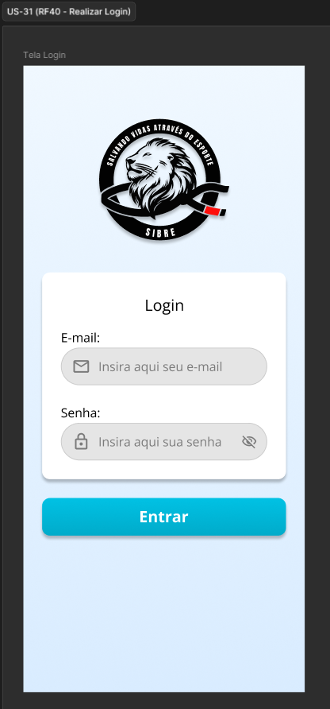

# US-31 — Login no Sistema

!!! quote "História de Usuário"
    > *"Como **Voluntário**, quero realizar o login com minhas credenciais, para acessar as funcionalidades protegidas e restritas ao meu perfil de forma segura."*
    > 
    > **Requisito Relacionado:** [RF40](../../Visão%20do%20Produto%20e%20Projeto/requisitosDeSoftware.md#rf40)

---

### Rota no App

!!! info "Navegação passo a passo"
    - `Tela Inicial de Login` (`/`) ➔ Preencher E-mail e Senha ➔ Botão **"Entrar"**

---

### Critérios de Aceitação

- [x] O sistema deve solicitar um endereço de e-mail e uma senha válidos para realizar a autenticação do usuário.
- [x] Quando as credenciais informadas forem válidas, o sistema deve autenticar o usuário e redirecioná-lo para a tela inicial.
- [x] Quando as credenciais informadas forem inválidas, o sistema deve impedir o acesso e exibir uma mensagem indicando credenciais incorretas.

---

### Protótipos de Média Fidelidade

---

!!! check "Definition of Ready (DoR)"
    - [x] O requisito está devidamente documentado?
    - [x] O requisito é viável em termos de tempo e complexidade?
    - [x] O requisito foi priorizado?
    - [x] O requisito está claro e delimitado?
    - [x] A User Story foi prototipada?
    - [x] A User Story é testável e rastreável?
    - [x] A User Story foi validada pelo cliente?
