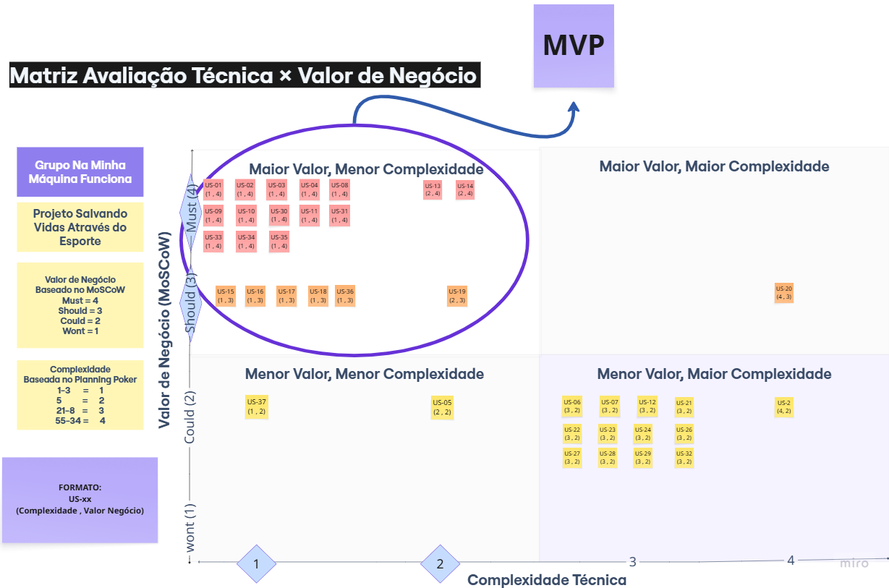

# Quadro MVP

| História de Usuário | Status | Comentários e Justificativas |
| :--- | :---: | :--- |
| [US-01 - Cadastro de Aluno](./USsMVP/US-01.md) | Implementado | - |
| [US-02 — Edição e Busca de Aluno](./USsMVP/US-02.md) | Implementado | - |
| [US-03 — Inativação e Reativação de Aluno](./USsMVP/US-03.md) | Implementado | - |
| [US-07 — Matrícula de Aluno em Turma](./USsMVP/US-07.md) | Implementado | - |
| [US-08 — Cancelamento de Matrícula](./USsMVP/US-08.md) | Implementado | - |
| [US-09 — Registro de Presença em Aula](./USsMVP/US-09.md) | Implementado | - |
| [US-10 — Correção de Registro de Presença](./USsMVP/US-10.md) | Implementado | - |
| [US-12 — Consulta de Histórico de Presença](./USsMVP/US-12.md) | Implementado | - |
| [US-13 — Monitoramento de Risco de Evasão](./USsMVP/US-13.md) | Implementado | - |
| [US-14 — Registro de Doação e Consulta de Estoque de Kimonos](./USsMVP/US-14.md) | Implementado | - |
| [US-15 — Registro de Perda ou Dano de Kimono](./USsMVP/US-15.md) | Implementado | - |
| [US-16 — Registro de Empréstimo de Kimono](./USsMVP/US-16.md) | Implementado | - |
| [US-17 — Registro de Devolução de Kimono](./USsMVP/US-17.md) | Implementado | - |
| [US-18 — Aniversariantes da Semana no Dashboard](./USsMVP/US-18.md) | Implementado | - |
| [US-28 — Cadastro e Edição de Voluntários](./USsMVP/US-28.md) | Implementado | - |
| [US-29 — Inativação e Reativação de Voluntários](./USsMVP/US-29.md) | Implementado | - |
| [US-31 — Login no Sistema](./USsMVP/US-31.md) | Implementado | - |
| [US-32 — Encerramento de Sessão](./USsMVP/US-32.md) | Implementado | - |

## 5. Matriz de Avaliação Técnica × Valor de Negócio

A matriz abaixo apresenta a distribuição das histórias de usuário segundo os eixos de complexidade técnica e valor de negócio, com destaque para o quadrante correspondente ao MVP aprovado.

{ width="800" }

**Figura 1:** Matriz MVP. Fonte: Elaborada por Júlia Gabriella

Disponível em: [Matriz Avaliação Técnica x Valor Negócio](https://miro.com/app/board/uXjVHT_JmM8=/?share_link_id=938810057712)

<!--<iframe width="768" height="496" src="https://miro.com/app/live-embed/uXjVHT_JmM8=/?focusWidget=3458764647487987076&embedMode=view_only_without_ui&embedId=195967925908" frameborder="0" scrolling="no" allow="fullscreen; clipboard-read; clipboard-write" allowfullscreen></iframe>-->

