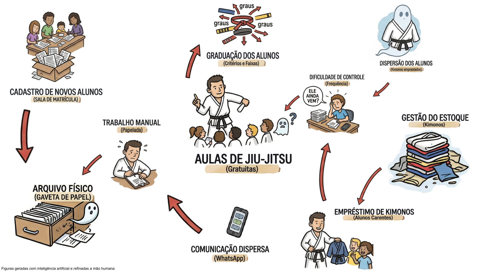
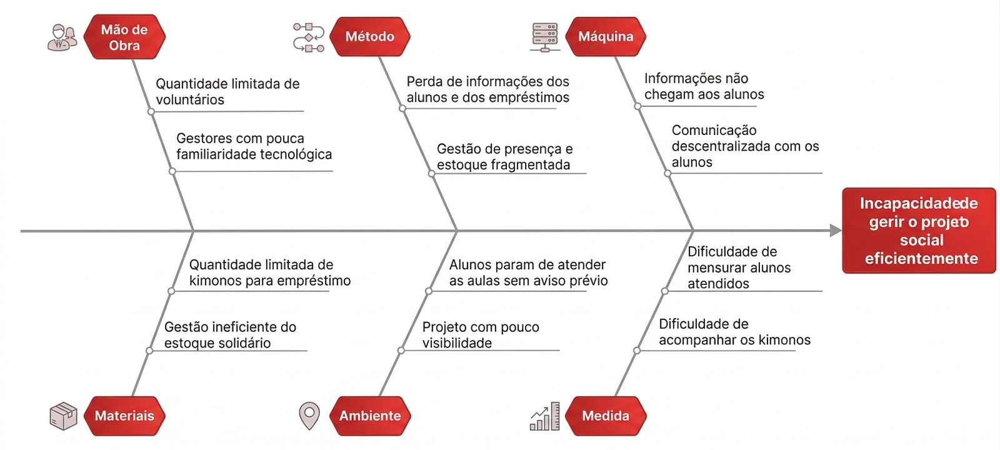
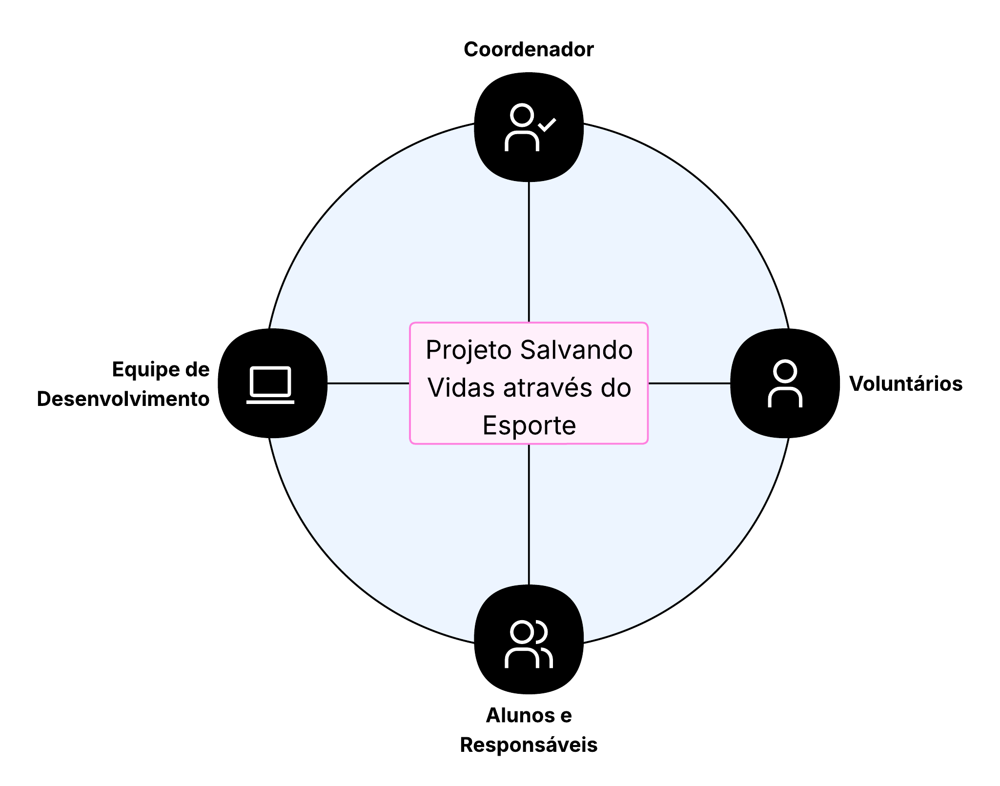

# Visão do Produto e Projeto

| Versão | Data | Descrição | Autores |
| :---:  | :---:| :---:     | :---    |
| 0.1 | 01/04/2026| Identificação do contexto do negócio do cliente | Pedro L; Júlia G. |
| 0.2 | 02/04/2026 | Identificação da oportunidade/problema, Desafios do Projeto e Segmentação de Clientes | Pedro L.; Júlia G.;  Giovani; José A. |
| 0.3 | 07/04/2026 | Adição da Proposta de Solução Geral e Objetivos Especificos sem correções | Pedro L. |
| 0.4 | 08/04/2026 | Inclusão da pilha tecnológica, da viabilidade da proposta e do mapa de stakeholders | José A. | 
| 0.5 | 10/04/2026 | Inclusão da Pesquisa de Mercado e Análise Competitiva e da Interação entre Equipe e Cliente | Lucas O. | 

## 1.1 Identificação do Cliente/Parceiro

- Nome: Projeto Salvando Vidas através do Esporte 
- Tipo: Iniciativa Social
- Representante: José Lucas Siqueira
- Forma de Contato: Reuniões online e encontros presencias quando necessário
- Vínculo com o projeto: Coordenador do projeto

## 1.2 introdução ao Negócio e Contexto

 O projeto <strong>Salvando Vidas Através do Esporte</strong>, realizado pela Segunda Igreja Batista do Recanto das Emas desde 2019, oferece aulas gratuitas de jiu-jitsu voltadas à comunidade, com foco 
principal em jovens e famílias, muitas vezes em situação de vulnerabilidade social. Além da prática esportiva, o projeto também desempenha um importante papel de assistência social, promovendo a 
doação e o empréstimo de kimonos para alunos que não possuem condições de adquiri-los. 

 Atualmente, entretanto, grande parte da gestão do projeto ocorre de forma manual e descentralizada. O controle de alunos, registros de frequência, acompanhamento da evolução de faixas e a gestão 
dos materiais doados são realizados por meio de fichas de papel e trocas de mensagens em grupos de WhatsApp. Essa forma de organização dificulta o acesso às informações, aumenta o risco de perda de dados e torna o acompanhamento dos alunos e dos recursos do projeto mais complexo. 

## 1.3 Rich Picture

- <strong> Atores: </strong> Instrutor, Voluntário Administrativo, Aluno/Responsável, Doador.
- 
<strong> Fluxo problemático atual: </strong> O aluno/resposável realiza o cadastro por meio do preenchimento de fichas em papel, que posteriormente são armazenadas em arquivos físicos, dificultando o acesso e a organização das informações. Durante as aulas, o instrutor precisa confiar na própria memória para acompanhar a evolução dos alunos e registrar graduações, enquanto o controle de frequência torna-se impreciso diante do grande volume de informações Paralelamente, o empréstimo de kimonos para alunos em situação de vulnerabilidade não possui um sistema formal de registro, sendo controlado informalmente por meio de mensagens antigas no WhatsApp. Como consequência, quando um aluno deixa de frequentar as aulas, não há um mecanismo que notifique os responsáveis pela gestão, o que dificulta a recuperação do kimono emprestado e compromete a rotatividade do estoque, além de prejudicar o acompanhamento e o contato da assistência social.

## 1.4 Identificação da Oportunidade ou Problema

Atualmente, o projeto social de jiu-jitsu sofre com a fragmentação de informações e a dependência de processos manuais (fichas de papel) e comunicações informais (grupos de WhatsApp). Essa falta de centralização e automação gera uma série de problemas operacionais que limitam o impacto social da iniciativa, destacando-se: 

- <strong>Falha no monitoramento de frequência, Perda de vínculo e Acolhimento tardio: </strong>  Como  o  controle  da  assiduidade  não  é  sistematizado,  o  abandono  dos  treinos  muitas vezes  só  é  notado  muito  tempo  depois.  Essa  falta  de  visibilidade  quebra  a  rede  de apoio  proporcionada  pelo  projeto,  impedindo  que  os  voluntários entrem  em  contato rapidamente  para  entender  as  necessidades  do  aluno  e  acolher famílias  que  possam estar enfrentando novas vulnerabilidades.

- <strong>Ineficiência na gestão do estoque solidário: </strong> O   controle de recebimento e empréstimo de kimonos é realizado de maneira informal, o que dificulta o rastreio desses ativos. Não há o controle  preciso de quantos kimonos estão sendo doados ao projeto, quantos   foram distribuídos e para quem. Além disso, frequentemente, os materiais ficam retidos com alunos que não estão mais ativos. Essa falta de visibilidade gera um déficit de equipamentos, impedindo ou atrasando a aquisição para novos participantes que não possuem condições financeiras para adquirir o uniforme.

- <strong>Gestão de dados fragmentada e Perdas de históricos:</strong> O preenchimento de formulários de inscrição em papel e o acompanhamento de graduações (faixas e graus) dependem da memória dos instrutores ou de anotações físicas que se perdem com facilidade.

- <strong>Dificuldade em mensurar e comprovar impacto: </strong> A ausência de um banco de dados impede a geração de relatórios rápidos sobre o número de jovens atendidos e o volume de doações distribuídas, dificultando a prestação de contas à comunidade e a atração de novos doadores.

A figura apresenta o Diagrama de Ishikawa do projeto Salvando Vidas Através do Esporte, no qual são organizadas as possíveis causas do problema identificado segundo os 6M’s (Método, Mão de Obra, Máquina, Material, Medição e Meio Ambiente). No diagrama, o fator Meio Ambiente é representado apenas como Ambiente, mantendo o mesmo significado. 

## 1.5 Desafios do Projeto

O principal desafio operacional é a adoção da tecnologia por um público-alvo (voluntários e responsáveis) que preferem processos manuais e possuem letramento digital básico. Do ponto de vista técnico e de requisitos, o desafio será garantir uma usabilidade extrema, exigindo que a interface seja simples, prática e que se integre facilmente aos hábitos atuais (por exemplo, facilitando o envio de notificações e justificativas via WhatsApp). O sistema deve resolver a desorganização sem criar uma nova barreira de burocracia para a igreja.

## 1.6 Mapa de Stakeholders

A seguir é apresentado um quadro resumo dos stakeholders e adiante uma representação gráfica dos mesmos.

| Stakeholder | Relação com a solução | Interesse Principal | Influência |
| :---------- | :-------------------- | :------------------ | :--------: |
| Coordenador do Projeto | Usuário direto e responsável pela gestão da solução | Gerenciamento dos recursos e alunos do projeto | Alta |
| Voluntários do Projeto | Usuários diretos da solução | Receber uma ferramenta com informações centralizadas que facilite processos administrativos | Média |
| Equipe de Desenvolvimento | Responsável pela construção | Entregar uma aplicação que atenda às necessidades reais do cliente | Alta |
| Alunos e Responsáveis | Beneficiários finais (indiretos) | Receber um atendimento eficiente, de qualidade e transparente | Baixa |

## 1.7 Segmentação de Clientes

O projeto social tem como principal público-alvo a população em situação de vulnerabilidade do Recanto das Emas, oferecendo tanto aulas gratuitas de jiu-jitsu quanto kimonos para aqueles que não possuem condições de adquirir o próprio equipamento. Esse contexto gera a necessidade de uma gestão eficiente dos recursos disponíveis especialmente dos kimonos doados e emprestados aos alunos. Um controle adequado desses materiais é essencial para garantir que o maior número possível de participantes possa usufruir da assistência oferecida pelo projeto.
